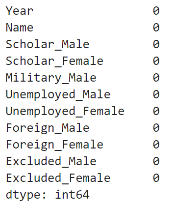
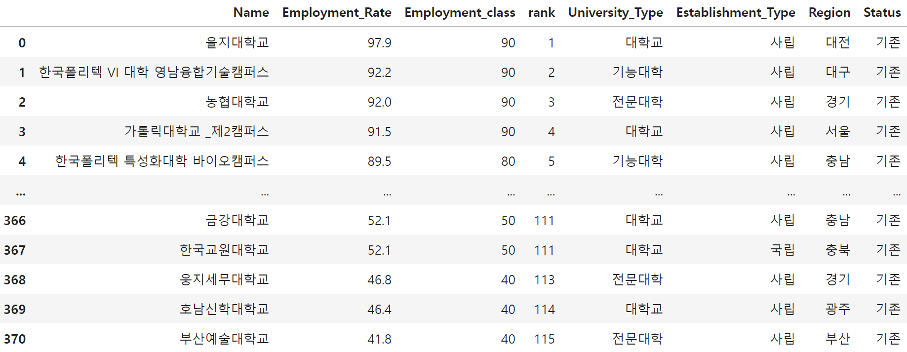

# 전국 대학교 취업률 현황 분석

<br>


<br>

2024.04.23.

<br></br>
<br></br>
<br></br>
<br></br>
<br></br>

# Ⅰ. 프로젝트 개요
## 1. 프로젝트 목표
2020학년도부터 2022학년도까지 3개년 전국 대학 취업률 분석을 통해 각 대학의 취업률 순위 및 현황을 확인하고 대학 혁신 전략을 발굴

<br></br>
<br></br>

## 2. 데이터 흐름
### ○ 데이터 분석 프로세스

<br>


<br></br>
<br></br>

## 3. 데이터 수집
✔ 데이터 정보  
대학 알리미 홈페이지의 일부 수정된 공시자료 활용  
https://www.academyinfo.go.kr/index.do

<br>

✔ 총 데이터 개수: 58189개 데이터

<br>

✔ 대학 정보 (6개 feature)

| 연번 |  컬럼명                | 컬럼 설명  |
|:---:|:-------------------:|:------:|
| 1  | Year                | 연도     |
| 2  | university_Type     | 학교 종류  |
| 3  | Establishment_Type  | 설립구분   |
| 4  | Region              | 지역     |
| 5  | Status              | 상태     |
| 6  | Name                | 학교명    |

<br>

✔ 졸업생 취업 현황 (25개 feature)

| 연번 |  컬럼명                        | 컬럼 설명         |
|:---:|:---------------------------:|:-------------:|
| 1  | Year                        | 연도            |
| 2  | Name                        | 학교명           |
| 3  | Graduates_Male              | 졸업자_남         |
| 4  | Graduates_Female            | 졸업자_여         |
| 5  | Employed_Male               | 건강보험직장가입자_남   |
| 6  | Employed_Female             | 건강보험직장가입자_여   |
| 7  | Overseas_Employment_Male    | 해외 취업자_남      |
| 8  | Overseas_Employment_Female  | 해외 취업자_여      |
| 9  | Agriculture_Fishery_Male    | 농림어업 종사자_남    |
| 10 | Agriculture_Fishery_Female  | 농림어업 종사자_여    |
| 11 | Creative_Activities_Male    | 개인창작활동종사자_남   |
| 12 | Creative_Activities_Female  | 개인창작활동종사자_여   |
| 13 | Entrepreneurship_Male       | 1인창(사)업자_남    |
| 14 | Entrepreneurship_Female     | 1인창(사)업자_여    |
| 15 | Freelancer_Male             | 프리랜서_남        |
| 16 | Freelancer_Female           | 프리랜서_여        |
| 17 | Uncounted_Male              | 취업률 미집계_남     |
| 18 | Uncounted_Female            | 취업률 미집계_여     |
| 19 | Others_Male                 | 기타_남          |
| 20 | Others_Female               | 기타_여          |
| 21 | Employment_Rate:            | 취업률           |
| 22 | Pre_Employment_Male         | 입학 당시 기취업자_남  |
| 23 | Pre_Employment_Female       | 입학 당시 기취업자_여  |
| 24 | Campus_Employment_Male      | 교내취업자_남       |
| 25 | Campus_Employment_Female    | 교내취업자_여       |

<sub>
※ 취업률 계산법 <br>
{(Employed + Overseas_Employment + Agriculture_Fishery + Creative_Activities + Entrepreneurship +Freelancer) / (Graduates - Uncounted)} * 100
</sub>

<br>

✔ 졸업생 취업 제외 인정 현황 (11개 feature)

| 연번 |  컬럼명               | 컬럼 설명     |
|:---:|:------------------:|:---------:|
| 1  | Year               | 연도        |
| 2  | Name               | 학교명       |
| 3  | Scholar_Male       | 진학자_남     |
| 4  | Scholar_Female     | 진학자_여     |
| 5  | Military_Male      | 입대자_남     |
| 6  | Unemployed_Male    | 취업불가능자_남  |
| 7  | Unemployed_Female  | 취업불가능자_여  |
| 8  | Foreign_Male       | 외국인유학생_남  |
| 9  | Foreign_Female     | 외국인유학생_여  |
| 10 | Excluded_Male      | 제외인정자_남   |
| 11 | Excluded_Female    | 제외인정자_여   |
| 12 | Excluded_Female    | 제외인정자_여   |

<sub>
※ 제외 인정자 <br>
의료급여 수급권자, 여군 중 임관전 훈련생, 종교지도자 양성 학생
</sub>

<br></br>
<br></br>
<br></br>
<br></br>
<br></br>

# Ⅱ. 데이터 탐색 및 전처리
## 1. 대학 정보 데이터 탐색
### ○ info


<details>
  <summary>code</summary>

  ```
  # un_df의 정보 가져오기
  un_df.info()
  ```
</details>

<br></br>

### ○ 결측치 검사


<details>
  <summary>code</summary>

  ```
  # un_df 결측치 개수 가져오기
  un_df.isna().sum()
  ```
</details>

<br></br>

### ○ info


<details>
  <summary>code</summary>

  ```
  # un_df의 중복행 개수를 가져오기
  un_df.duplicated().sum()
  ```
</details>

<br></br>

### ○ 각 피처의 데이터 별 개수 확인
✔ 학년도 별 데이터 개수


<details>
  <summary>code</summary>

  ```
  year_count = un_df['Year'].value_counts().reset_index()
  year_count
  ```
</details>

<br>

✔ 대학 종류 별 데이터 개수


<details>
  <summary>code</summary>

  ```
  u_type_count = un_df['University_Type'].value_counts().reset_index()
  u_type_count
  ```
</details>

<br>

✔ 대학 설립 구분 별 데이터 개수


<details>
  <summary>code</summary>

  ```
  e_type_count = un_df['Establishment_Type'].value_counts().reset_index()
  e_type_count
  ```
</details>

<br>

✔ 대학 지역 별 데이터 개수


<details>
  <summary>code</summary>

  ```
  re_count = un_df['Region'].value_counts().reset_index()
  re_count
  ```
</details>

<br>

✔ 대학 폐교 여부 별 데이터 개수


<details>
  <summary>code</summary>

  ```
  sta_count = un_df['Status'].value_counts().reset_index()
  sta_count
  ```
</details>

<br></br>

### ○ 대학 현황
✔ 학년도 별 대학 비중 확인

✔ 전체 데이터 중 폐교 비중 확인


<details>
  <summary>code</summary>

  ```
  import matplotlib.pyplot as plt
  import numpy as np

  # 타겟 데이터 비중 변경 전/후 차이 그래프 확인
  fig, axes = plt.subplots(1, 2, figsize=(12, 10))

  # 부채꼴 스타일
  wedgeprops = {'width': 0.7, 'edgecolor': 'w', 'linewidth': 1}

  year_counts = year_count['count']
  year_labels = year_count['Year']

  status_counts = sta_count['count']
  status_labels = sta_count['Status']

  # 그래프 그리기
  axes[0].pie(year_counts, labels=year_labels, colors=colors, autopct='%1.1f%%', startangle=90, wedgeprops=wedgeprops)
  axes[0].set_title('연도')

  axes[1].pie(status_counts, labels=status_labels, colors=colors, autopct='%1.1f%%', startangle=90, wedgeprops=wedgeprops)
  axes[1].set_title('상태')

  plt.tight_layout()
  plt.show()
  ```
</details>

<br></br>

## 2. 대학 별 취업률 데이터 탐색
### ○ info


<details>
  <summary>code</summary>

  ```
  # em_df의 정보 가져오기
  em_df.info()
  ```
</details>

<br></br>

### ○ 결측치 검사


<details>
  <summary>code</summary>

  ```
  em_df.isna().sum()
  ```
</details>

<br></br>

### ○ 중복행 검사


<details>
  <summary>code</summary>

  ```
  em_df.duplicated().sum()
  ```
</details>

<br></br>

### ○ 요약 통계 정보
✔ 숫자형 데이터 개수, 평균, 표준편차, 최소값, 사분위 분포도, 최대값 확인


<details>
  <summary>code</summary>

  ```
  em_df.describe().T
  ```
</details>

<br></br>

### ○ 각 피처 별 데이터 개수 확인

✔ 학년도 별 데이터 개수


<details>
  <summary>code</summary>

  ```
  em_df['Year'].value_counts()
  ```
</details>

<br>

✔ 대학 별 데이터 개수


<details>
  <summary>code</summary>

  ```
  em_df['Name'].value_counts()
  ```
</details>

<br></br>
<br></br>

## 3. 대학 별 취업률 미집계 데이터 세트
### ○ info


<details>
  <summary>code</summary>

  ```
  # uc_df의 정보 가져오기
  uc_df.info()
  ```
</details>

<br></br>

### ○ 결측치 검사


<details>
  <summary>code</summary>

  ```
  uc_df.isna().sum()
  ```
</details>

<br></br>

### ○ 중복행 검사


<details>
  <summary>code</summary>

  ```
  uc_df.duplicated().sum()
  ```
</details>

<br></br>
<br></br>

## 4. 분석 및 가설
### ○ 분석
✔ 대한민국 대학 정보 및 대학 별 취업률 현황 데이터 프리셋

✔ 2020학년도 부터 2022학년도까지 3개년의 데이터가 존재함

✔ 결측치와 중복행이 존재하지 않음

✔ 취업률에서 최솟값을 0으로 가지는 데이터가 존재함

✔ 폐교 되거나 3년 치 데이터를 가지지 못하는 데이터가 존재함

<br></br>

### ○ 가설
✔ 폐교된 학교의 데이터는 제거해주는 것이 옳지 않을까?

✔ 3년 치 데이터 분석이 목표이기 때문에 3년 치를 가지지 못하는 데이터는 제거해주는 것이 옳지 않을까?

✔ 취업률이 0으로 나오는 데이터가 정확한 데이터가 맞는가? 정상범위 확인을 통해 이상치를 제거해줘야 하지 않을까?  

✔ 졸업생이 적어 취업률이 0으로 나오는 데이터도 있을 수 있지 않을까?

<br></br>
<br></br>

## 5. 전처리
### ○ 폐교된 대학교 데이터 제거
✔ 폐교 상태인 데이터 제거

✔ 학년도에 따라 폐교 상태가 아닌 대학이 존재할 수 있으므로 폐교 상태인 데이터 제거 후 3개년 치 데이터를 가지지 못하는 대학 추가 제거

<details>
  <summary>폐교된 대학 제거 code</summary>

  ```
  # 폐교된 대학교의 데이터를 제거하여 새로운 데이터 프레임에 담아주기
  un_up_df = un_df[~ (un_df['Status'] == '폐교')]
  un_up_df
  ```
</details>
<details>
  <summary>기준 미달 대학 제거 code</summary>

  ```
  # 학교명 데이터 값의 개수 계산
  un_name_count = un_up_df['Name'].value_counts()

  # 학교명 데이터 개수가 3보다 작은 값 추출
  un_name_remove = un_name_count[un_name_count < 3].index

  # 해당하는 Name 값을 가지는 행 삭제
  un_up_df = un_up_df[~ un_up_df['Name'].isin(un_name_remove)].reset_index(drop=True)
  un_up_df
  ```
</details>

<br></br>

### ○ 3년치 취업률이 없는 데이터 제거
✔ 3년 치 데이터 분석이 목표이기 때문에 3년 치를 가지지 못하는 데이터는 제거

<details>
  <summary>code</summary>

  ```
  # em_df 데이터 복사하기
  em_up_df = em_df.copy()

  # 폐교되지 않은 학교명 추출
  un_name = set(un_up_df['Name'])

  # 폐교되거나 3년 치 데이터가 없는 행 삭제
  em_up_df = em_up_df[em_up_df['Name'].isin(un_name)].reset_index(drop=True)
  em_up_df
  ```
</details>

### ○ 제거된 대학 데이터 제거
✔ 대학 별 취업률 미집계 데이터 세트에도 제거된 대학 데이터 제거

<details>
  <summary>code</summary>

  ```
  # 이상치 제거
  uc_df = uc_df[uc_df['Name'].isin(em_up_df['Name'])].reset_index(drop=True)
  uc_df
  ```
</details>

<br></br>

### ○ 연도 별 대학 데이터 추출

<details>
  <summary>code</summary>

  ```
  em_2020_df = em_up_df[em_up_df['Year'] == 2020]
  em_2021_df = em_up_df[em_up_df['Year'] == 2021]
  em_2022_df = em_up_df[em_up_df['Year'] == 2022]
  ```
</details>

<br></br>

### ○ 대학 목록 확인
✔ 대학 데이터 세트 생성

✔ 대학 정보 데이터세트를 가공하여 생성하며, 필요없는 컬럼과 중복행은 제거

<details>
  <summary>불필요한 컬럼 제거 code</summary>

  ```
  un_list_df = un_up_df.drop(labels='Year', axis=1)
  un_list_df
  ```
</details>
<details>
  <summary>중복행 확인 code</summary>

  ```
  # 중복행 개수 확인
  un_list_df.duplicated().sum()
  ```
</details>
<details>
  <summary>중복행 제거 code</summary>

  ```
  # 중복행 삭제
  # 1개 데이터는 반드시 유지해야 하기 때문에 keep을 사용하며 마지막 데이터만 유지
  un_list_df = un_list_df.drop_duplicates(keep="last").reset_index(drop=True)
  ```
</details>

<br></br>

### ○ 형변환
✔ 대학 별 취업률 데이터 세트와 대학 별 취업률 미집계 데이터 세트의 데이터에 ,(콤마)가 존재하므로 replace를 통해 제거 후, int로 형변환

<details>
  <summary>대학 별 취업률 데이터 세트 code</summary>

  ```
  Employed_copy_all = em_up_df.copy()

  Employed_all = Employed_copy_all[['Year', 'Name']].copy()

  # 졸업 인원
  Employed_copy_all['Graduates_Male'] = Employed_copy_all['Graduates_Male'].str.replace(',', '').astype(int)
  Employed_copy_all['Graduates_Female'] = Employed_copy_all['Graduates_Female'].str.replace(',', '').astype(int)

  Employed_all['Graduates_total'] = Employed_copy_all['Graduates_Male'] + Employed_copy_all['Graduates_Female']

  # 건강보험직장가입자
  Employed_copy_all['Employed_Male'] = Employed_copy_all['Employed_Male'].str.replace(',', '').astype(int)
  Employed_copy_all['Employed_Female'] = Employed_copy_all['Employed_Female'].str.replace(',', '').astype(int)

  Employed_all['Employed_total'] = Employed_copy_all['Employed_Male'] + Employed_copy_all['Employed_Female']

  # 해외 취업자
  Employed_copy_all['Overseas_Employment_Male'] = Employed_copy_all['Overseas_Employment_Male'].astype(int)
  Employed_copy_all['Overseas_Employment_Female'] = Employed_copy_all['Overseas_Employment_Female'].astype(int)

  Employed_all['Overseas_Employment_total'] = Employed_copy_all['Overseas_Employment_Male'] + Employed_copy_all['Overseas_Employment_Female']

  # 농림어업 종사자
  Employed_copy_all['Agriculture_Fishery_Male'] = Employed_copy_all['Agriculture_Fishery_Male'].astype(int)
  Employed_copy_all['Agriculture_Fishery_Female'] = Employed_copy_all['Agriculture_Fishery_Female'].astype(int)

  Employed_all['Agriculture_Fishery_total'] = Employed_copy_all['Agriculture_Fishery_Male'] + Employed_copy_all['Agriculture_Fishery_Female']

  # 개인창작활동종사자
  Employed_copy_all['Creative_Activities_Male'] = Employed_copy_all['Creative_Activities_Male'].astype(int)
  Employed_copy_all['Creative_Activities_Female'] = Employed_copy_all['Creative_Activities_Female'].astype(int)

  Employed_all['Creative_Activities_total'] = Employed_copy_all['Creative_Activities_Male'] + Employed_copy_all['Creative_Activities_Female']

  # 1인창(사)업자
  Employed_copy_all['Entrepreneurship_Male'] = Employed_copy_all['Entrepreneurship_Male'].astype(int)
  Employed_copy_all['Entrepreneurship_Female'] = Employed_copy_all['Entrepreneurship_Female'].astype(int)

  Employed_all['Entrepreneurship_total'] = Employed_copy_all['Entrepreneurship_Male'] + Employed_copy_all['Entrepreneurship_Female']

  # 프리랜서
  Employed_copy_all['Freelancer_Male'] = Employed_copy_all['Freelancer_Male'].astype(int)
  Employed_copy_all['Freelancer_Female'] = Employed_copy_all['Freelancer_Female'].astype(int)

  Employed_all['Freelancer_total'] = Employed_copy_all['Freelancer_Male'] + Employed_copy_all['Freelancer_Female']

  # 취업률 미집계
  Employed_copy_all['Uncounted_Male'] = Employed_copy_all['Uncounted_Male'].astype(int)
  Employed_copy_all['Uncounted_Female'] = Employed_copy_all['Uncounted_Female'].astype(int)

  Employed_all['Uncounted_total'] = Employed_copy_all['Uncounted_Male'] + Employed_copy_all['Uncounted_Female']

  # 입학 당시 기취업자
  Employed_copy_all['Pre_Employment_Male'] = Employed_copy_all['Pre_Employment_Male'].astype(int)
  Employed_copy_all['Pre_Employment_Female'] = Employed_copy_all['Pre_Employment_Female'].astype(int)

  Employed_all['Pre_Employment_total'] = Employed_copy_all['Pre_Employment_Male'] + Employed_copy_all['Pre_Employment_Female']

  # 교내취업자
  Employed_copy_all['Campus_Employment_Male'] = Employed_copy_all['Campus_Employment_Male'].astype(int)
  Employed_copy_all['Campus_Employment_Female'] = Employed_copy_all['Campus_Employment_Female'].astype(int)

  Employed_all['Campus_Employment_total'] = Employed_copy_all['Campus_Employment_Male'] + Employed_copy_all['Pre_Employment_Female']

  # 기타
  Employed_copy_all['Others_Male'] = Employed_copy_all['Others_Male'].str.replace(',', '').astype(int)
  Employed_copy_all['Others_Female'] = Employed_copy_all['Others_Female'].str.replace(',', '').astype(int)

  Employed_all['Others_total'] = Employed_copy_all['Others_Male'] + Employed_copy_all['Others_Female']


  Employed_all
  ```
</details>
<details>
  <summary>대학 별 취업률 미집계 데이터 세트 code</summary>

  ```
  uncounted_copy_all = uc_df.copy()

  uncounted_all = uncounted_copy_all[['Year', 'Name']].copy()

  # 진학자 인원
  uncounted_copy_all['Scholar_Male'] = uncounted_copy_all['Scholar_Male'].astype(int)
  uncounted_copy_all['Scholar_Female'] = uncounted_copy_all['Scholar_Female'].astype(int)

  uncounted_all['Scholar_total'] = uncounted_copy_all['Scholar_Male'] + uncounted_copy_all['Scholar_Female']

  # 입대자 인원
  uncounted_all['Military_total'] = uncounted_copy_all['Military_Male'].astype(int)

  # 취업불가능자 인원
  uncounted_copy_all['Unemployed_Male'] = uncounted_copy_all['Unemployed_Male'].astype(int)
  uncounted_copy_all['Unemployed_Female'] = uncounted_copy_all['Unemployed_Female'].astype(int)

  uncounted_all['Unemployed_total'] = uncounted_copy_all['Unemployed_Male'] + uncounted_copy_all['Unemployed_Female']

  # 외국인 유학생 인원
  uncounted_copy_all['Foreign_Male'] = uncounted_copy_all['Foreign_Male'].astype(int)
  uncounted_copy_all['Foreign_Female'] = uncounted_copy_all['Foreign_Female'].astype(int)

  uncounted_all['Foreign_total'] = uncounted_copy_all['Foreign_Male'] + uncounted_copy_all['Foreign_Female']

  # 제외인정자 인원
  uncounted_copy_all['Excluded_Male'] = uncounted_copy_all['Excluded_Male'].astype(int)
  uncounted_copy_all['Excluded_Female'] = uncounted_copy_all['Excluded_Female'].astype(int)

  uncounted_all['Excluded_total'] = uncounted_copy_all['Excluded_Male'] + uncounted_copy_all['Excluded_Female']

  uncounted_all
  ```
</details>

<br></br>
<br></br>
<br></br>
<br></br>
<br></br>

# Ⅲ. 데이터 분석
## 1. 전체 대학 종류


<details>
  <summary>code</summary>

  ```
  # 대학 종류에 대한 카운트 계산
  university_type_counts = un_list_df['University_Type'].value_counts()
  university_type_counts_df = university_type_counts.reset_index()
  display(university_type_counts_df)

  # 파이 차트 그리기
  # 파이 차트 크기 설정
  plt.figure(figsize=(20, 10))

  # 부채꼴 스타일
  wedgeprops={'width': 0.7, 'edgecolor': 'w', 'linewidth': 1}

  labels = university_type_counts_df['University_Type']
  sizes = university_type_counts_df['count']

  plt.rcParams['font.size'] = 15

  # 파이 차트 그리기, autopct: 각 항목의 비율을 소수점 첫째자리까지 표시, 첫 번째 항목이 시작되는 각도, 부채꼴 스타일
  patches, texts, autotexts = plt.pie(sizes, colors=colors, autopct='%1.1f%%', startangle=253, wedgeprops=wedgeprops) 
  for i, (label, size) in enumerate(zip(labels, sizes)):
      x, y = autotexts[i].get_position()
      if i == 0:
          autotexts[i].set_position((x+0.27, y+0.1))
          autotexts[i].set_color('black')
      if i == 1:
          autotexts[i].set_position((x-0.327, y-0.25))
          autotexts[i].set_color('black')
      if i == 2:
          autotexts[i].set_position((x-0.21, y-0.24))
          autotexts[i].set_color('black')
      if i == 3:
          autotexts[i].set_position((x-0.138, y-0.3))
          autotexts[i].set_color('black')
      if i == 4:
          autotexts[i].set_position((x-0.15, y-0.43))
          autotexts[i].set_color('black')
      if i == 5:
          autotexts[i].set_position((x-0.14, y-0.5))
          autotexts[i].set_color('black')

  # 원형으로 설정
  plt.axis('equal')
  #파이 차트 제목 설정
  plt.title('University Type')
  plt.legend(university_type_counts_df['University_Type'])

  plt.show()
  ```
</details>

<br></br>

### ○ 분석
✔ 데이터 중 일반대학이 209개(54.7%)로 가장 높은 비중을 차지했음

✔ 전문대학 131개(34.3%), 기능대학 28개(7.3%), 교육대학 10개(2.6%), 각종학교(대학) 및 산업대학이 각 2개(0.5%) 순으로 나타남

<br></br>

### ○ 가설
✔ 일반대학과 전문대학이 높은 비중을 차지하고 있는 만큼 취업률의 비중도 일반대학과 전문대학의 비중이 높지 않을까?

<br></br>
<br></br>

## 2. 전체 대학 설립 구분, 지역

✔ 전국 대학 설립 구분


<br>

✔ 전국 대학 지역


<details>
  <summary>code</summary>

  ```
  establishment = un_list_df['Establishment_Type'].value_counts().reset_index()
  region = un_list_df['Region'].value_counts().reset_index()

  fig, axes = plt.subplots(2, 1, figsize=(15, 10))

  plt.rcParams['font.size'] = 12

  sns.countplot(ax=axes[0], x='Establishment_Type', data=un_list_df, palette=colors)
  # axes[0].tick_params(axis='x', rotation=90)
  axes[0].set_title('전체 대학 설립 구분')
  sns.countplot(ax=axes[1], x='Region', data=un_list_df, palette=colors)
  axes[1].tick_params(axis='x', rotation=90)
  axes[1].set_title('전체 대학 지역')

  display(establishment)
  display(region)

  plt.tight_layout()
  plt.show()
  ```
</details>

<br></br>

### ○ 분석
✔ 2022학년도 기준 대한민국의 전국 대학교는 382개교로 집계됨

✔ 사립대학이 326개교로 가장 많으며, 국립대 법인 대학이 3개교로 가장 적음

✔ 사립대 졸업생이 취업률에 가장 높은 비중을 차지할 것으로 보여짐

✔ 전국 대학 위치는 경기 및 서울 지역이 각 69개교, 55개교로 가장 많이 나타났으며, 세종 지역이 4개교로 가장 적음

✔ 서울, 경기 지역이 전체 비율의 32%를 차지하며, 수도권 지역에 밀집됨

<br></br>
<br></br>

## 3. 전국 대학 남녀 성비

✔ 3개년 전국 대학 남녀 성비


<br>

✔ 3개년 전국 대학 취업률 남녀 성비


<details>
  <summary>전체 대학 졸업자 성비 code</summary>

  ```
  # 학년도, 대학명, 남자/여자 명수 가져와서 새로운 데이터 프레임에 담기
  graduates_all = Employed_copy_all[['Year', 'Name', 'Graduates_Male', 'Graduates_Female']].copy()

  # 각 대학 남자/여자 명수 더하여 토탈 카운트 계산
  graduates_all['Graduates_total'] = graduates_all['Graduates_Male'] + graduates_all['Graduates_Female']

  # 대학 별 3년 치 남자/여자 취업생 확인 
  graduates_all_total = graduates_all.groupby('Name').sum('Graduates_total').reset_index()
  graduates_all_total = graduates_all_total.drop(labels='Year', axis=1)

  # 졸업생 토탈, 학교 정보 데이터 프레임 합치기
  graduates_all_total = pd.merge(graduates_all_total, un_list_df, on='Name')

  # 남자 합계 구하기
  male_total = graduates_all_total['Graduates_Male'].sum()
  # 새로운 데이터 프레임에 담기
  gender = pd.DataFrame({'Male': [male_total]})
  # 여자 합계 구하고 피처 추가
  gender['Female'] = graduates_all_total['Graduates_Female'].sum()

  # 데이터 프레임 행과 열 변경 후 새로운 인덱스 값 넣기
  gender_df = gender.T.reset_index()
  # 피처명 변경
  gender_df = gender_df.rename(columns={'index': 'gender', 0: 'count'})

  # 전체 인원 중 남녀 비율 확인
  gender_all = gender_df['count'].sum()

  gender_df['percentage'] = round((gender_df['count'] / gender_all) * 100, 2)
  ```
</details>
<details>
  <summary>남녀 취업률 평균 code</summary>

  ```
  # 각 대학교 취업률 포함 데이터 모두 합산
  male_Employed = Employed_copy_all['Employed_Male'] +  Employed_copy_all['Overseas_Employment_Male'] + Employed_copy_all['Agriculture_Fishery_Male'] + Employed_copy_all['Entrepreneurship_Male'] + Employed_copy_all['Freelancer_Male']
  female_Employed = Employed_copy_all['Employed_Female'] +  Employed_copy_all['Overseas_Employment_Female'] + Employed_copy_all['Agriculture_Fishery_Female'] + Employed_copy_all['Entrepreneurship_Female'] + Employed_copy_all['Freelancer_Female']

  # 전체 취업률 데이터 합산
  male_Employed = male_Employed.sum()
  female_Employed = female_Employed.sum()

  # 각 성별 카운트 데이터 값 가져오기
  all_male_count = gender_df[gender_df['gender'] == 'Male']['count'].values[0]
  all_female_count = gender_df[gender_df['gender'] == 'Female']['count'].values[0]

  # 전체 취업률 미집계 데이터 합산
  all_uncounted_male = Employed_copy_all['Uncounted_Male'].sum()
  all_uncounted_female = Employed_copy_all['Uncounted_Female'].sum()

  # 남녀 별 취업률 구하고 소수점 2째 자리까지 보여주기
  male_Employed_rate = round((male_Employed / (all_male_count - all_uncounted_male)) * 100, 2)
  female_Employed_rate = round((female_Employed / (all_female_count - all_uncounted_female)) * 100, 2)

  # 새로운 데이터 프레임에 남녀 취업률 데이터 담기
  gender_Employed = pd.DataFrame({'male_Employed': [male_Employed_rate]})
  gender_Employed['female_Employed'] = female_Employed_rate

  # 데이터 프레임 행, 열 위치 변경
  gender_Employed_df = gender_Employed.T.reset_index()

  # 피처명 변경
  gender_Employed_df = gender_Employed_df.rename(columns={'index': 'gender', 0: 'Employed'})
  ```
</details>
<details>
  <summary>그래프 code</summary>

  ```
  fig, axes = plt.subplots(1, 2, figsize=(15, 7))

  plt.rcParams['font.size'] = 12

  # 전체 대학 남여 성비 확인
  sns.barplot(ax=axes[0], x='gender', y='percentage', data=gender_df, palette=colors)
  # axes[0].tick_params(axis='x', rotation=90)
  axes[0].set_title('2020학년도~2022학년도 전체 대학 남녀 성비')
  # 전체 대학 남여 취업률 확인
  sns.barplot(ax=axes[1], x='gender', y='Employed', data=gender_Employed_df, palette=colors)
  # axes[1].tick_params(axis='x', rotation=90)
  axes[1].set_title('2020학년도~2022학년도 전체 대학 취업률 남녀 성비')

  display(gender_df)
  display(gender_Employed_df)

  plt.tight_layout()
  plt.show()
  ```
</details>

<br></br>

### ○ 분석
✔ 전체 대학의 졸업자 남녀 비율은 여자 졸업생이 약 2.7% 정도 높음

✔ 전체 대학의 취업률 남녀 비율은 남자 졸업생이 약 3.16% 정도 높음

✔ 졸업생 비율은 여성이 더 우세하나 취업률은 남성이 더 우세한 것으로 나타남

<br></br>
<br></br>

## 4. 전국 대학 취업률
✔ 취업률이 0%인 대학교는 순위에 포함하지 않음

<details>
  <summary>취업률 계급 함수 code</summary>

  ```
  # 취업률 계급 책정을 위한 함수 선언
  def get_class(x):
      if x <= 19:
          return 10
      if x >= 20 and x < 30:
          return 20
      if x >= 30 and x < 40:
          return 30
      if x >= 40 and x < 50:
          return 40
      if x >= 50 and x < 60:
          return 50
      if x >= 60 and x < 70:
          return 60
      if x >= 70 and x < 80:
          return 70
      if x >= 80 and x < 90:
          return 80
      if x >= 90 and x < 100:
          return 90
      return 1
  ```
</details>

<br></br>

✔ 전국 대학 취업률 순위(3년 평균)


<details>
  <summary>code</summary>

  ```
  # 각 대학 별 3년간 평균 취업률 계산
  em_all_rank = em_up_df.groupby('Name')['Employment_Rate'].mean().reset_index()
  em_rank = em_all_rank[~ (em_all_rank['Employment_Rate'] == 0)]

  # 전체 대학 취업률 내림차순 정렬
  em_rank = em_rank.sort_values(by='Employment_Rate', ascending=False).reset_index(drop=True)

  # 취업률 계급 넣기
  em_rank['Employment_class'] = em_rank['Employment_Rate'].apply(get_class)

  # 전체 대학 취업률 순위 넣기
  em_rank['rank'] = em_rank['Employment_Rate'].rank(ascending=False)

  # 순위 정수로 형변환
  em_rank = em_rank.astype({'rank': 'int8'})

  # 데이터 프레임 합치기
  em_rank = pd.merge(em_rank, un_list_df, on='Name')

  display(em_rank)
  ```
</details>

<br>

✔ 2020학년도 대학 취업률 순위


<details>
  <summary>code</summary>

  ```
  # 대학 별 3년간 평균 취업률 계산
  em_2020_all_rank = em_2020_df.groupby('Name')['Employment_Rate'].mean().reset_index()
  em_2020_rank = em_2020_all_rank[~ (em_2020_all_rank['Employment_Rate'] == 0)]

  # 전체 대학 취업률 내림차순 정렬
  em_2020_rank = em_2020_rank.sort_values(by='Employment_Rate', ascending=False).reset_index(drop=True)

  # 취업률 계급 넣기
  em_2020_rank['Employment_class'] = em_2020_rank['Employment_Rate'].apply(get_class)

  # 전체 대학 취업률 순위 넣기
  em_2020_rank['rank'] = em_2020_rank['Employment_Rate'].rank(ascending=False)

  # 순위 정수로 형변환
  em_2020_rank = em_2020_rank.astype({'rank': 'int8'})

  em_2020_rank = pd.merge(em_2020_rank, un_list_df, on='Name')
  em_2020_rank
  ```
</details>


<br>

✔ 2021학년도 대학 취업률 순위


<details>
  <summary>code</summary>

  ```
  # 대학 별 3년간 평균 취업률 계산
  em_2021_all_rank = em_2021_df.groupby('Name')['Employment_Rate'].mean().reset_index()
  em_2021_rank = em_2021_all_rank[~ (em_2021_all_rank['Employment_Rate'] == 0)]

  # 전체 대학 취업률 내림차순 정렬
  em_2021_rank = em_2021_rank.sort_values(by='Employment_Rate', ascending=False).reset_index(drop=True)

  # 취업률 계급 넣기
  em_2021_rank['Employment_class'] = em_2021_rank['Employment_Rate'].apply(get_class)

  # 전체 대학 취업률 순위 넣기
  em_2021_rank['rank'] = em_2021_rank['Employment_Rate'].rank(ascending=False)

  # 순위 정수로 형변환
  em_2021_rank = em_2021_rank.astype({'rank': 'int8'})

  em_2021_rank = pd.merge(em_2021_rank, un_list_df, on='Name')
  em_2021_rank
  ```
</details>

<br>

✔ 2022학년도 대학 취업률 순위



<details>
  <summary>code</summary>

  ```
  # 대학 별 3년간 평균 취업률 계산
  em_2022_all_rank = em_2022_df.groupby('Name')['Employment_Rate'].mean().reset_index()
  em_2022_rank = em_2022_all_rank[~ (em_2022_all_rank['Employment_Rate'] == 0)]

  # 전체 대학 취업률 내림차순 정렬
  em_2022_rank = em_2022_rank.sort_values(by='Employment_Rate', ascending=False).reset_index(drop=True)

  # 취업률 계급 넣기
  em_2022_rank['Employment_class'] = em_2022_rank['Employment_Rate'].apply(get_class)

  # 전체 대학 취업률 순위 넣기
  em_2022_rank['rank'] = em_2022_rank['Employment_Rate'].rank(ascending=False)

  # 순위 정수로 형변환
  em_2022_rank = em_2022_rank.astype({'rank': 'int8'})

  em_2022_rank = pd.merge(em_2022_rank, un_list_df, on='Name')
  em_2022_rank
  ```
</details>

<br>

✔ 대학 취업률 히스토그램


<details>
  <summary>전체 code</summary>

  ```
  # 취업률 데이터가 담긴 데이터프레임의 "Employment_Rate" 열을 이용하여 히스토그램 그리기
  plt.figure(figsize=(20, 8))
  # 20개의 구간으로 나누어 히스토그램 그리기
  plt.hist(em_rank['Employment_Rate'], bins=20, color=colors[1], edgecolor='black')
  # x축 레이블 설정
  plt.xlabel('Employment Rate')
  # y축 레이블 설정
  plt.ylabel('Frequency')
  # 그래프 제목 설정
  plt.title('2020학년도~2022학년도 대학 취업률')
  # 그리드 표시
  plt.grid(True)
  plt.show()
  ```
</details>
<details>
  <summary>학년도 별 code</summary>

  ```
  # 히스토그램을 그릴 학년도별 대학 취업률 데이터 프레임과 학년도 리스트
  em_rank_dataframes = [em_2020_rank, em_2021_rank, em_2022_rank]
  years = ['2020', '2021', '2022']

  # 서브플롯 생성
  fig, axes = plt.subplots(1, 3, figsize=(15, 5))

  # 각 서브플롯에 대한 히스토그램 그리기
  for i, (dataframe, year) in enumerate(zip(em_rank_dataframes, years)):
      axes[i].hist(dataframe['Employment_Rate'], bins=20, color=colors[1], edgecolor='black')
      axes[i].set_xlabel('Employment Rate')
      axes[i].set_ylabel('Frequency')
      axes[i].set_title(f'{year}학년도 대학 취업률')
      axes[i].grid(True)

  plt.tight_layout()
  plt.show()
  ```
</details>

<br></br>

### ○ 분석
✔ 취업률 약 60~80%를 달성한 대학의 분포가 높게 나타나고, 3년간 비슷한 양상을 보임

✔ 전체 취업률 중 농협대학교가 취업률 약 93.86%로 가장 높은 취업률을 달성하였으며, 부산예술대학이 약 42.53%로 가장 낮은 취업률을 달성

✔ 농협대학교의 경우 단위농협에서 운영하는 대학으로 졸업 후 해당 기업의 취업추천 제도 또는 농협대학 지원 전형이 있어 높은 취업률을 달성

✔ 부산예술대학교은 예술 교과과정의 자율성을 지키고자 대학기본역량에 참여하지 않는 등 취·창업에 중점을 두고 있지 않아 저조한 취업률이 나타났다 판단됨

<br></br>

### ○ 가설
✔ 취업률이 저조한 대학의 취업률 미집계 데이터 확인이 필요

<br></br>
<br></br>

## 5. 대학 종류 별 취업률 비중


<details>
  <summary>대학 종류 별 취업률 계산 code</summary>

  ```
  # 대학 종류별로 취업률의 합계를 계산
  employment_rate_sum = em_rank.groupby('University_Type')['Employment_Rate'].sum()

  # 전체 취업률의 합계를 계산
  total_employment_rate = em_rank['Employment_Rate'].sum()

  # 각 대학 종류별로 취업률의 비중을 계산
  employment_rate_weight = employment_rate_sum / total_employment_rate

  # 비중 백분율로 변환
  employment_rate_weight = pd.DataFrame(employment_rate_weight).reset_index()
  perentile = pd.DataFrame(round((employment_rate_sum / total_employment_rate) * 100, 2)).reset_index()

  # 데이터 프레임 합치기
  employment_rate_weight = pd.merge(employment_rate_weight, perentile, on='University_Type')
  # 데이터 프레임 피처명 변경
  employment_rate_weight = employment_rate_weight.rename(columns={'Employment_Rate_x': 'Employment_Rate', 'Employment_Rate_y': 'perentile'})
  display(employment_rate_weight)
  ```
</details>
<details>
  <summary>그래프 code</summary>

  ```
  plt.figure(figsize=(20, 8))

  # 대학 종류 별 취업률 비중
  sns.barplot(x='University_Type', y='perentile', data=employment_rate_weight, palette=colors)
  plt.title('2020학년도~2022학년도 대학 종류 별 취업률 비중')
  plt.show()
  ```
</details>

<br></br>

### ○ 분석
✔ 취업률은 일반대학이 약 50.91%로 가장 높은 비중을 차지함

✔ 대학 종류의 비중과 대학 종류 별 취업 비중이 유사하게 나타는 것을 보아 종류의 개수가 취업률에 영향을 미침

<br></br>
<br></br>

## 6. 취업률이 0%인 대학교
✔ 취업률이 0%인 대학교 (3년 평균)


<details>
  <summary>code</summary>

  ```
  # 취업률이 0인 대학교 데이터 가져오기
  em_zero_rank = em_all_rank[em_all_rank['Employment_Rate'] == 0.0]
  em_zero_rank = pd.merge(em_zero_rank, un_list_df, on='Name')
  em_zero_rank
  ```
</details>

<br>

✔ 2020학년도 취업률이 0%인 대학교


<details>
  <summary>code</summary>

  ```
  # 2020학년도 취업률이 0인 대학교 데이터 가져오기
  em_2020_zero_rank = em_2020_all_rank[em_2020_all_rank['Employment_Rate'] == 0.0]
  em_2020_zero_rank = pd.merge(em_2020_zero_rank, un_list_df, on='Name')
  em_2020_zero_rank
  ```
</details>

<br>

✔ 2021학년도 취업률이 0%인 대학교


<details>
  <summary>code</summary>

  ```
  # 2021학년도 취업률이 0인 대학교 데이터 가져오기
  em_2021_zero_rank = em_2021_all_rank[em_2021_all_rank['Employment_Rate'] == 0.0]
  em_2021_zero_rank = pd.merge(em_2021_zero_rank, un_list_df, on='Name')
  em_2021_zero_rank
  ```
</details>

<br>

✔ 2022학년도 취업률이 0%인 대학교


<details>
  <summary>code</summary>

  ```
  # 2022학년도 취업률이 0인 대학교 데이터 가져오기
  em_2022_zero_rank = em_2022_all_rank[em_2022_all_rank['Employment_Rate'] == 0.0]
  em_2022_zero_rank = pd.merge(em_2022_zero_rank, un_list_df, on='Name')
  em_2022_zero_rank
  ```
</details>

<br></br>

### ○ 분석
✔ 3년간 취업률이 0%로 나타는 대학은 총 11개의 대학

✔ '한국폴리텍 V 대학 순천캠퍼스'는 2021학년도에만 취업률이 0%로 집계된 것을 확인

✔ 취업률 미집계 대학은 대부분 종교 특성을 지닌 대학이며, 졸업생의 대부분이 취업 대신 진학 또는 종교 단체(4대 보험 미적용)에 포함된 것으로 판단됨

<br></br>

### ○ 가설
✔ 졸업생이 있으나 취업률이 0인 대학의 학생들은 취업률 미집계 데이터에 포함된 것이 아닐까?

<br></br>
<br></br>

## 7. 취업률이 0%인 대학의 취업률 미집계 현황 (3개년)


<details>
  <summary>계산 code</summary>

  ```
  # 전체 대학 3년 치 취업률 미집계 인원 집계 후 새로운 데이터 프레임 생성
  Uncounted_df = Employed_all.groupby('Name')['Uncounted_total'].sum().reset_index()
  # 졸업생 인원 비교를 위해 데이터 프레임에 졸업생 카운트 피처 추가
  Uncounted_df['Graduates_total'] = Employed_all.groupby('Name')['Graduates_total'].sum().reset_index()['Graduates_total']

  # 취업률 미집계 데이터 정리
  uncounted_total = uncounted_all.groupby('Name').sum('Scholar_total').reset_index()
  # year테이블 삭제
  uncounted_total = uncounted_total.drop(labels='Year', axis=1)

  # 데이터 프레임 병합
  Uncounted_df = pd.merge(Uncounted_df, uncounted_total, on='Name')

  # 취업률 0인 대학의 데이터만 남기기
  Uncounted_df = Uncounted_df[~ Uncounted_df['Name'].isin(em_rank['Name'])].reset_index(drop=True)

  Uncounted_df
  ```
</details>
<details>
  <summary>그래프 code</summary>

  ```
  # 데이터 프레임에서 학교명과 각 항목의 값을 추출합니다.
  schools = Uncounted_df['Name']
  scholar_total = Uncounted_df['Scholar_total']
  military_total = Uncounted_df['Military_total']
  unemployed_total = Uncounted_df['Unemployed_total']
  foreign_total = Uncounted_df['Foreign_total']
  excluded_total = Uncounted_df['Excluded_total']

  # 그래프를 그리기 위한 설정
  plt.figure(figsize=(14, 8))
  plt.bar(schools, excluded_total, color=colors[0], label='제외인정자')
  plt.bar(schools, scholar_total, color=colors[1], label='진학자')
  plt.bar(schools, military_total, color=colors[2], label='입대자')
  plt.bar(schools, unemployed_total, color=colors[3], label='취업불가능자')
  plt.bar(schools, foreign_total, color=colors[4], label='외국인유학생')


  # 그래프에 대한 라벨과 범례 추가
  plt.xlabel('학교명')
  plt.ylabel('취업률 미집계 수')
  plt.title('취업률이 0%인 대학의 취업률 미집계 현황')
  plt.xticks(rotation=90)
  plt.legend()

  # 그래프 출력
  plt.tight_layout()
  plt.show()
  ```
</details>

<br></br>

### ○ 분석
✔ 3년 간 취업률이 0%로 나오는 대학의 졸업생 전원이 취업률 미집계 데이터로 집계

✔ 제외인정자로 들어간 학생이 가장 많았고, 진학자가 다음으로 많은 것을 확인

✔ 제외인정자 집계 기준 중 '종교지도자 양성 학생'이 포함됨에 따라 제외인정자의 경우 종교와 관련 사유로 취업률에 집계되지 않았다 판단됨

<br></br>
<br></br>

## 8. 2021학년도 한국폴리텍 V 대학 순천캠퍼스 취업률 미집계 현황
✔ 2021학년도 한국폴리텍 V 대학 순천캠퍼스 취업률 미집계 현황


<details>
  <summary>계산 code</summary>

  ```
  # 전체 대학 2022학년도 데이터만 추출하여 새로운 데이터 프레임 생성
  Uncounted_2021_df = Employed_all[Employed_all['Year'] == 2021].reset_index(drop=True)
  # 필요한 피처만 가져오기
  Uncounted_2021_df = Uncounted_2021_df[['Name', 'Graduates_total', 'Uncounted_total', 'Others_total']]
  # 한국폴리텍 V 대학 순천캠퍼스의 정보만 가져오기
  Uncounted_2021_df = Uncounted_2021_df[Uncounted_2021_df['Name'] == '한국폴리텍 V 대학 순천캠퍼스']
  display(Uncounted_2021_df)

  # 그래프 그리기 쉽도록 데이터 프레임 수정
  Uncounted_2021_up_df = Uncounted_2021_df.T.reset_index()
  Uncounted_2021_up_df = Uncounted_2021_up_df[~ (Uncounted_2021_up_df['index'] == 'Name')]
  Uncounted_2021_up_df = Uncounted_2021_up_df[~ (Uncounted_2021_up_df['index'] == 'Graduates_total')]. reset_index(drop=True)
  Uncounted_2021_up_df = Uncounted_2021_up_df.rename(columns={'index': 'uncounted', 363: 'count'})
  ```
</details>
<details>
  <summary>그래프 code</summary>

  ```
  plt.figure(figsize=(6, 5))

  # 취업률 미집계 현황 확인
  sns.barplot(x='uncounted', y='count', data=Uncounted_2021_up_df, palette=colors)

  plt.show()
  ```
</details>

<br>

✔ 2021학년도 한국폴리텍 V 대학 순천캠퍼스 졸업생 성비


<details>
  <summary>계산 code</summary>

  ```
  # 졸업생 성별 확인
  po_2021_df = Employed_copy_all[Employed_copy_all['Name'] == '한국폴리텍 V 대학 순천캠퍼스']
  po_2021_df = po_2021_df[po_2021_df['Year'] == 2021]

  selected_data = po_2021_df[['Name', 'Graduates_Male', 'Graduates_Female']].reset_index(drop=True)
  selected_data
  ```
</details>
<details>
  <summary>그래프 code</summary>

  ```
  selected_data.plot(kind='bar', color=colors)

  # 그래프에 대한 라벨과 타이틀 추가
  plt.xlabel('한국폴리텍 V 대학 순천캠퍼스')
  plt.ylabel('졸업생 수')
  plt.title('한국폴리텍 V 대학 순천캠퍼스 졸업생 성별 현황')

  # 그래프 출력
  plt.xticks(rotation=90)
  plt.tight_layout()
  plt.show()
  ```
</details>

<br></br>

### ○ 분석
✔ 2021학년도 '한국폴리텍 V 대학 순천캠퍼스'의 졸업생은 모두 남성으로 나타남

✔ 졸업자 11명 중 취업률 미집계 데이터 9개, 미상 데이터 2개로 나타남

✔ 별개의 캠퍼스로 나눠져 있는 폴리텍대학 특성상 재학생/졸업생 수가 현저히 적어 취업률이 0%로 집계되었다고 판단됨

<br></br>

### ○ 가설
✔ 취업을 주 목적으로 하는 종합기술전문대학에서 왜 취업률 0%로 집계됐을까?

✔ 대학 내 남학생 비율이 높은데, 졸업생들의 입대와 관련이 있을까?

<br></br>
<br></br>

## 9. 2021학년도 한국폴리텍 V 대학 순천캠퍼스 취업률 미집계 세부 현황


<details>
  <summary>계산 code</summary>

  ```
  # 취업률 미집계 데이터 정리
  uncounted_all_2021 = uncounted_all[uncounted_all['Year'] == 2021]
  uncounted_all_2021 = uncounted_all_2021[uncounted_all_2021['Name'] == '한국폴리텍 V 대학 순천캠퍼스']

  # year테이블 삭제
  uncounted_all_2021_total = uncounted_all_2021.drop(labels='Year', axis=1)
  display(uncounted_all_2021_total)

  # 그래프를 그리기 쉽도록 데이터 프레임 수정
  uncounted_all_2021_up_total = uncounted_all_2021_total.drop(labels='Name', axis=1)
  uncounted_all_2021_up_total = uncounted_all_2021_up_total.T.reset_index()
  uncounted_all_2021_up_total = uncounted_all_2021_up_total.rename(columns={'index': 'uncounted_detail', 745: 'count'})
  ```
</details>
<details>
  <summary>그래프 code</summary>

  ```
  plt.figure(figsize=(15, 7))

  # 취업률 미집계 세부 확인
  sns.barplot(x='uncounted_detail', y='count', data=uncounted_all_2021_up_total, palette=colors)
  plt.xticks(rotation=90)
  plt.title('한국폴리텍 V 대학 순천캠퍼스 취업률 미집계 세부 현황')

  plt.tight_layout()
  plt.show()
  ```
</details>

<br></br>

### ○ 분석
✔ 졸업생은 졸업 후 모두 입대했음을 확인함

✔ 2/3년제 전문대 및 남성 비율이 높은 대학에서 입대로 인한 취업률 감소 현상이 나타남

<br></br>
<br></br>
<br></br>
<br></br>
<br></br>

# Ⅳ. 결론
## 1. 데이터 분석 요약
### ○ 3개년 전국 대학 취업률


<br>

✔ 농협대학교가 취업률 약 93.86%로 가장 높고 부산예술대학이 약 42.53%로 가장 낮음

✔ 농협대학교의 경우 단위농협에서 운영하는 대학으로 졸업 후 해당 기업의 취업추천 제도 또는 농협대학 지원 전형이 있어 높은 취업률을 달성

✔ 부산예술대학교은 예술 교과과정의 자율성을 지키고자 대학기본역량에 참여하지 않는 등 취·창업에 중점을 두고 있지 않아 저조한 취업률이 나타났다 판단됨

<br></br>

### ○ 취업률 미집계 대학교 (3개년)


<br>

✔ 3년간 취업률이 0%로 나타는 대학은 총 11개의 대학

✔ 미집계 대학은 대부분 종교 특성의 대학이며, 취업률 제외인정자 집계 기준 중 '종교지도자 양성 학생'이 포함되어 종교 관련 사유로 취업률에 집계되지 않았다 판단됨

<br></br>

### ○ 전국대학 취업률 순위


<br></br>
<br></br>

## 2. 대학 혁신 전략
✔ **산학협력을 통한 직무 적합형 인재 발굴 및 취업연계**

<br>

| 교과목 개발 정책연구 |  산학협력 강화             |
|:---:|:----------------:|
|   |              |
| 취업까지 연계되는 교과목 개발 정책연구 진행  | 산학협력을 통해 인재 발굴 및 취업연계로 취업률 향상  |

<br>

- 전국 대학 취업률 상위권 대학인 '농협대학교'의 경우 산학협력을 통해 직무 적합형 인재를 발굴하고 취업까지 연계하여 취업률을 향상

- 가족회사(협약), 산학협력 교과목 개발(현장실습, 캡스톤디자인) 등을 통해 직무 적합형 인재를 발굴하고 취업까지 연계될 수 있도록 정책연구 진행이 필요

<br></br>
<br></br>

## 3. 개선방안
✔ **대학 특성에 따른 취업률 평가 기준 조정 필요**
- 부산예술대학의 사례로 보아 예술 분야 특화 대학 등 대학 특성에 따라 취업률이 저조할 수 있음을 확인함

- 대학역량진단 검사 시 대학 특성에 따른 평가 기준 조정이 필요할 것으로 보임