# Sport RFM Data Analysis Project
스포츠 용품 RFM 분석

<br>


<br>

2024.04.23.

<br></br>
<br></br>
<br></br>
<br></br>
<br></br>

# Ⅰ. 프로젝트 개요
## 1. 프로젝트 목표
스포츠 용품 판매점의 RFM을 분석하여 고객을 세분화하고 고객의 가치를 평가하여 효과적인 마케팅 전략을 발굴

<br></br>
<br></br>

## 2. 프로젝트 기획
✔ 고객 별 등급 분포 분석  
등급 별 소비액, 구입 품목, 활동성 분석

<br>

✔ 상품 판매량 분석
전체 상품 판매량 및 등급 별 판매량 분석

<br></br>
<br></br>

## 3. 프로젝트 기대효과
✔ 고객 충성도 강화 및 유지율 향상  
고객 세분화 맞춤형 마케팅을 실행하여 고객의 충성도 강화 및 유지율 향상

<br>

✔ 매출 증대  
구매 빈도를 분석하여 상품별 마케팅 전략 실행으로 매출 증대를 기대

<br></br>
<br></br>

## 4. 데이터 흐름
### ○ RFM 분석 프로세스

<br>

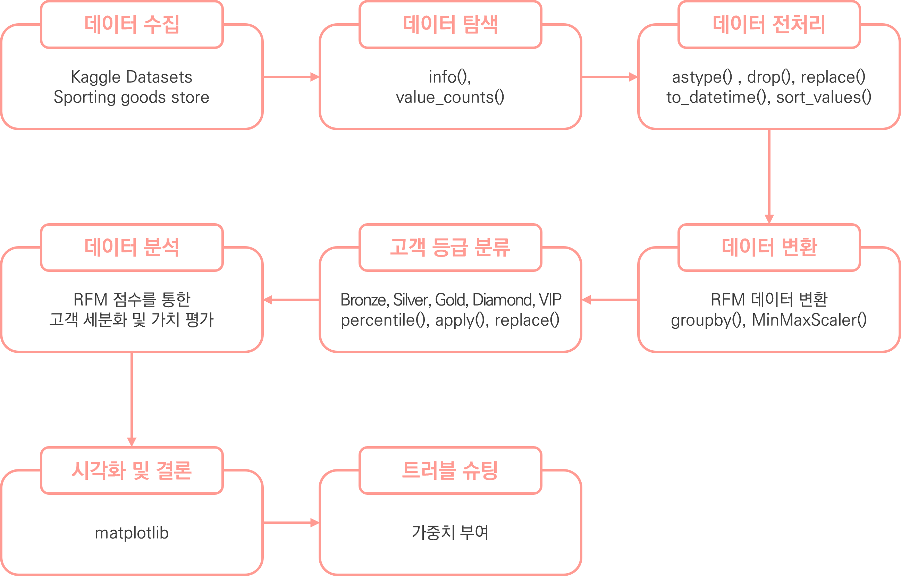


<br></br>
<br></br>

## 5. 데이터 수집
✔ 데이터 정보  
Kaggle의 Sporting goods store 데이터 세트 활용 (CSV 파일)  
https://www.kaggle.com/datasets/cnezhmar/sporting-goods-store

<br>

✔ 총 데이터 개수: 58189개 데이터

<br>

✔ 고객 데이터 (21개 feature)  

| 연번 |  컬럼명                  | 컬럼 설명         |
|:----:|:-----------------------:|:---------------:|
| 1  | CustomerKey           | 고객 ID         |
| 2  | FirstName             | 고객의 성         |
| 3  | LastName              | 고객 이름         |
| 4  | FullName              | 고객의 전체 이름     |
| 5  | BirthDate             | 생년월일          |
| 6  | MaritalStatus         | 결혼 상태         |
| 7  | Gender                | 성별            |
| 8  | YearlyIncome          | 연 소득          |
| 9  | TotalChildren         | 총 자녀 수        |
| 10 | NumberChildrenAtHome  | 집에 있는 자녀 수    |
| 11 | Education             | 고객 교육         |
| 12 | Occupation            | 고객의 직업        |
| 13 | HouseOwnerFlag        | 부동산(집)의 가용성   |
| 14 | NumberCarsOwned       | 소유한 자동차 수     |
| 15 | AddressLine1          | 고객의 거주지 주소    |
| 16 | DateFirstPurchase     | 첫 구매 날짜       |
| 17 | CommuteDistance       | 이동 거리         |
| 18 | CustomerCity          | 고객의 도시        |
| 19 | CustomerStateCode     | 고객의 주(지역) 코드  |
| 20 | CustomerState         | 고객의 주(지역)     |
| 21 | CustomerCountry       | 고객 국가         |

<br>

✔ 판매 데이터 (13개 feature)  

| 연번 |  컬럼명                  | 컬럼 설명      |
|:---:|:---------------------:|:----------:|
| 1  | ProductKey            | 제품 ID      |
| 2  | OrderDate             | 주문 날짜      |
| 3  | ShipDate              | 배송 날짜      |
| 4  | CustomerKey           | 고객 ID      |
| 5  | PromotionKey          | 광고 키       |
| 6  | SalesTerritoryKey     | 판매자 ID     |
| 7  | SalesOrderNumber      | 등록 키       |
| 8  | SalesOrderLineNumber  | 주문 번호      |
| 9  | OrderQuantity         | 주문 수량      |
| 10 | UnitPrice             | 상품 1개당 가격  |
| 11 | TotalProductCost      | 총 생산 비용    |
| 12 | SalesAmount           | 판매액        |
| 13 | TaxAmt                | 세액         |

<br></br>
<br></br>
<br></br>
<br></br>
<br></br>

# Ⅱ. 데이터 탐색 및 전처리
## 1. 회원 데이터 탐색
### ○ head

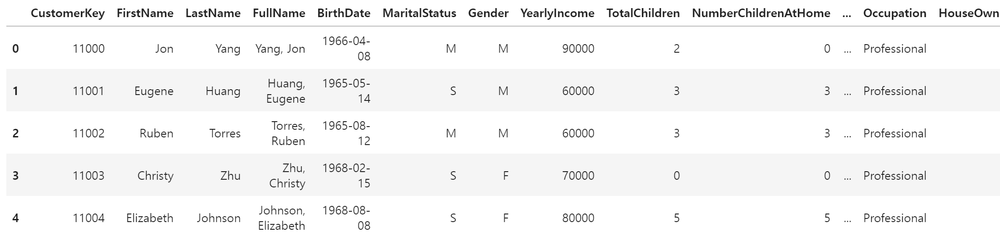
<details>
  <summary>code</summary>

  ```
  # 상위 5개 데이터 확인
  cu_df.head()
  ```
</details>

<br></br>

### ○ tail

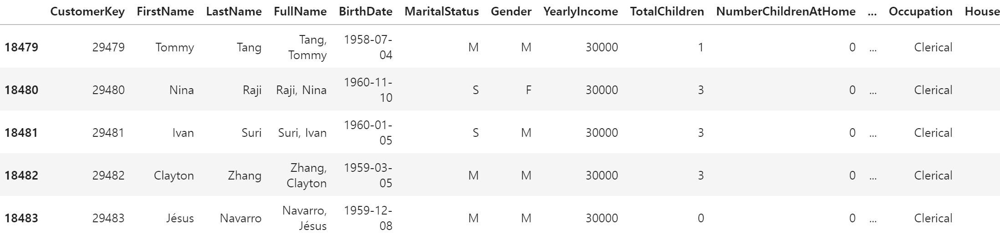
<details>
  <summary>code</summary>

  ```
  # 하위 5개 데이터 확인
  cu_df.tail()
  ```
</details>

<br></br>

### ○ info

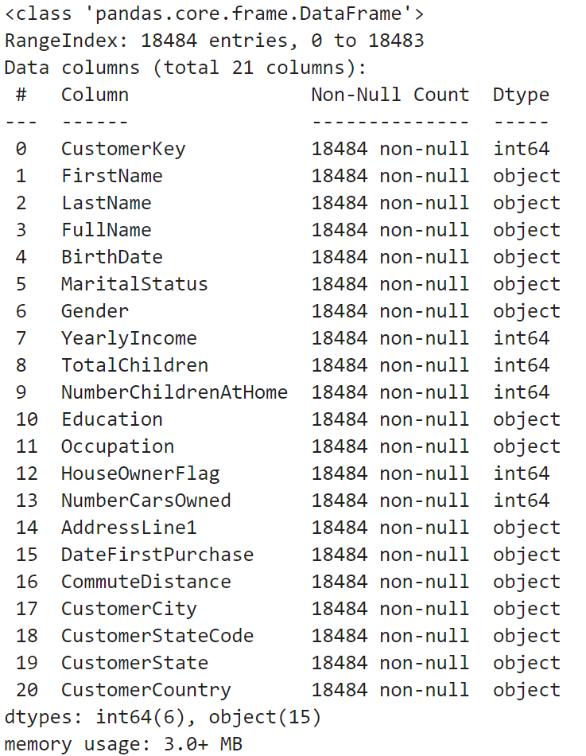
<details>
  <summary>code</summary>

  ```
  # cu_df 정보 가져오기
  cu_df.info()
  ```
</details>

<br></br>

### ○ 결측치 데이터 확인

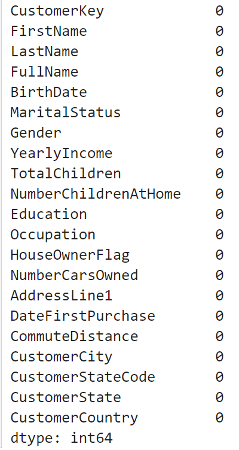
<details>
  <summary>code</summary>

  ```
  # 결측치 데이터 개수 확인
  cu_df.isna().sum()
  ```
</details>

<br></br>

### ○ 중복행 데이터 확인

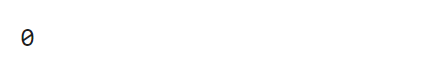
<details>
  <summary>code</summary>

  ```
  # 중복행 데이터 개수 확인
  cu_df.duplicated().sum()
  ```
</details>

<br></br>

### ○ 국가 확인

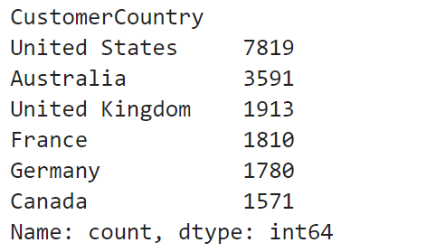
<details>
  <summary>code</summary>

  ```
  cu_df['CustomerCountry'].value_counts()
  ```
</details>

<br></br>

### ○ 분석
✔ 상/하위 다섯개 데이터를 확인한 결과 인덱스 외 고유의 ID 확인

✔ 결측치와 중복행은 없는 것으로 확인

<br></br>
<br></br>

## 2. 판매 데이터 탐색
### ○ head

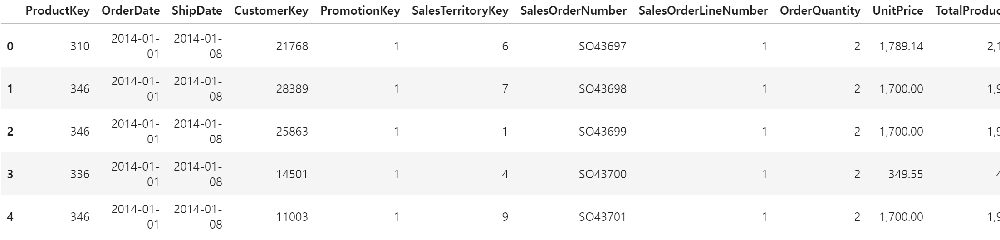
<details>
  <summary>code</summary>

  ```
  # 상위 5개 데이터 확인
  sa_df.head()
  ```
</details>

<br></br>

### ○ tail


<details>
  <summary>code</summary>

  ```
  # 하위 5개 데이터 확인
  sa_df.tail()
  ```
</details>

<br></br>

### ○ info

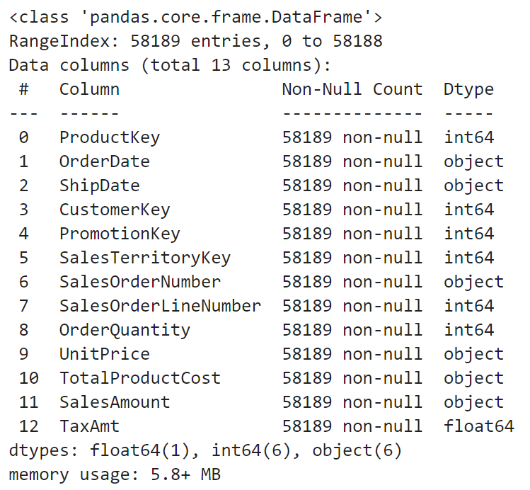
<details>
  <summary>code</summary>

  ```
  # sa_df 정보 가져오기
  sa_df.info()
  ```
</details>

<br></br>

### ○ 결측치 데이터 확인

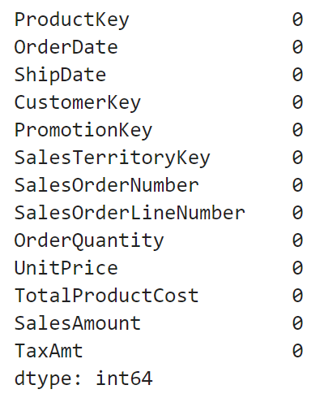
<details>
  <summary>code</summary>

  ```
  # 결측치 데이터 개수 확인
  sa_df.isna().sum()
  ```
</details>

<br></br>

### ○ 중복행 데이터 확인


<details>
  <summary>code</summary>

  ```
  # 중복행 데이터 개수 확인
  sa_up_df.duplicated().sum()
  ```
</details>

<br></br>

### ○ 분석
✔ 상/하위 다섯개 데이터를 확인한 결과 인덱스 외 고유의 ID 확인

✔ 고객 데이터의 CustomerKey 컬럼이 판매 데이터의 FK로 들어간 것을 확인함

✔ 결측치와 중복행은 없는 것으로 확인

✔ SalesAmount 컬럼에 ,(콤마)가 존재하는 것으로 확인되어 전처리가 필요함

✔ OrderDate 컬럼은 날짜 데이터가 존재하는 것으로 확인되며, Recency를 구하기 위해 datetime 형식 변환이 필요할 것으로 보임

<br></br>

### ○ 가설
✔ 환불된 주문 데이터가 있을까? (음수 확인 필요)

<br></br>
<br></br>

## 3. 데이터 전처리
### ○ replace
✔ SalesAmount 컬럼 데이터 속 ,(콤마) 제거

<details>
  <summary>code</summary>

  ```
  # replace를 통해 ,(콤마) 제거
  sa_df['SalesAmount'] = sa_df['SalesAmount'].str.replace(',', '').astype(float)
  ```
</details>


<br></br>

### ○ 음수 데이터 확인
✔ 환불된 데이터(음수)가 있는지 확인

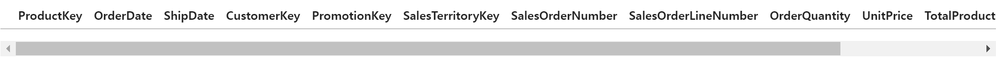
<details>
  <summary>code</summary>

  ```
  # 음수 데이터(환불) 존재 여부 확인
  sa_df[sa_df['SalesAmount'] <= 0]
  ```
</details>

<br></br>

### ○ 분석
✔ 환불된 데이터는 없는 것으로 확인

<br></br>

### ○ 컬럼 제거
✔ 프로젝트 분석 목표와 맞지 않는 컬럼 제거

✔ ShipDate(배송날짜), SalesOrderLineNumber(주문번호), UnitPrice(상품 1개당 가격)

<details>
  <summary>code</summary>

  ```
  # 불필요한 피처 삭제
  sa_up_df = sa_df.drop(labels=['ShipDate', 'SalesOrderLineNumber', 'UnitPrice'], axis=1)
  sa_up_df
  ```
</details>

<br></br>

### ○ datetime 형식 변환
✔ OrderDate 현재 기준으로 변경

<details>
  <summary>datetime 형식 변환 code</summary>

  ```
  # 날짜 데이터 datetime 형식 변환
  sa_up_df['OrderDate'] = pd.to_datetime(sa_up_df['OrderDate'])
  ```
</details>
<details>
  <summary>현재 기준으로 변경 code</summary>

  ```
  sa_date_df = sa_up_df.copy()

  # 데이터 중 가장 최신 날짜 가져오기
  recently_date = pd.to_datetime(sa_up_df['OrderDate'].max())
  print(recently_date)

  # 날짜 현재 기준으로 변경하기
  sa_up_df['OrderDate'] = (recently_date - pd.to_datetime(sa_up_df['OrderDate'])).dt.days

  # 날짜 오름차순 정렬(최신순)
  sa_up_df = sa_up_df.sort_values(by=['OrderDate'], ascending = True).reset_index(drop=True)
  sa_up_df
  ```
</details>

<br></br>

### ○ 순이익 계산
✔ 판매액 - (총 생산 비용 + 새액)

<details>
  <summary>형식 변환 code</summary>

  ```
  # 타입 변환

  # 주문 수량
  sa_up_df['OrderQuantity'] = sa_df['OrderQuantity'].astype(int)

  # 총 생산 비용
  sa_up_df['TotalProductCost'] = sa_df['TotalProductCost'].str.replace(',', '').astype(float)

  # 판매액
  sa_up_df['SalesAmount'] = sa_df['SalesAmount'].astype(float)

  # 세액
  sa_up_df['TaxAmt'] = sa_df['TaxAmt'].astype(float)
  ```
</details>
<details>
  <summary>순이익 계산 code</summary>

  ```
  # 순이익 계산
  SalesAmount = sa_up_df['SalesAmount']
  TotalProductCost = sa_up_df['TotalProductCost']
  TaxAmt = sa_up_df['TaxAmt']

  sa_up_df['NetProfit'] = SalesAmount - (TotalProductCost + TaxAmt)
  ```
</details>
<details>
  <summary>사용이 완료된 컬럼 제거 code</summary>

  ```
  # 사용된 피처 삭제
  sa_to_df = sa_up_df.drop(labels=['TotalProductCost', 'TaxAmt'], axis=1)
  sa_to_df
  ```
</details>

<br></br>
<br></br>
<br></br>
<br></br>
<br></br>

# Ⅲ. RFM
## 1. Recency
✔ 얼마나 최근에 구매했는가

✔ 고객의 마지막 구매일을 기준으로 현재 날짜까지의 경과일을 계산하여 점수를 산출

<details>
  <summary>code</summary>

  ```
  # 회원 별 최근 결제 일자 가져오기
  sa_new_df = sa_to_df.groupby('CustomerKey')['OrderDate'].min().reset_index(name='RecentlyDate')
  sa_new_df
  ```
</details>

<br></br>
<br></br>

## 2. Frequency
✔ 얼마나 자주 구매했는가

✔ 회원 별 주문 내역을 합산하여 주문 횟수를 산출

<details>
  <summary>code</summary>

  ```
  # 회원 별 주문 횟수 가져오기 (고유한 개수 세기)
  sa_new_df['OrderCount'] = sa_to_df.groupby('CustomerKey')['SalesOrderNumber'].nunique().reset_index()['SalesOrderNumber']
  sa_new_df
  ```
</details>

<br></br>
<br></br>

## 3. Monetary
✔ 얼마나 많은 금액을 지출했는가

✔ 회원 별 주문 금액을 합산하여 총 주문 금액을 산출

<details>
  <summary>code</summary>

  ```
  # 회원 별 총 주문 금액 가져오기
  sa_new_df['TotalPirce'] = sa_to_df.groupby('CustomerKey')['SalesAmount'].sum().reset_index()['SalesAmount']
  sa_new_df
  ```
</details>

<br></br>
<br></br>

## 4. RFM 데이터 변환
✔ TotalScore 책정

✔ MinMaxScaler를 사용하여 산출된 점수를 정규화

✔ Recency는 최신 일자의 점수가 가장 높아야 하므로, 1 – Recency를 하여 점수를 계산

✔ Recency, Frequency, Monetary 점수를 모두 합산하여 TotalScore라는 새로운 피처를 생성하고, 이는 각 회원의 점수를 나타냄

<details>
  <summary>정규화 code</summary>

  ```
  from sklearn.preprocessing import MinMaxScaler

  # 데이터 프레임 복사
  rfm = sa_new_df.copy()
  # CustomerKey 피처 삭제
  rfm = rfm.drop(labels=['CustomerKey'], axis=1)

  # 정규화 진행
  normalization = MinMaxScaler()
  rfm_normalization = normalization.fit_transform(rfm)

  # 정규화된 데이터를 데이터 프레임으로 변환, 피처는 rfm 데이터 프레임과 동일하게 설정
  rfm = pd.DataFrame(rfm_normalization, columns=rfm.columns)

  # recently_mean_date는 현재 낮을 수록 최신에 가깝고, 최신 점수가 더 높아야 하기 때문에 1을 빼서 점수를 높여준다.
  rfm['RecentlyDate'] = 1 - rfm['RecentlyDate']

  # rfm을 더하여 TotalScore 구하기
  sa_new_df['TotalScore'] = rfm[['RecentlyDate', 'OrderCount', 'TotalPirce']].sum(axis=1)
  sa_new_df
  ```
</details>

<br></br>
<br></br>

## 5. 회원 등급 제도
✔ 산출된 회원 별 점수를 통해 회원 등급 책정

✔ percentile()를 사용하여 TotalScore의 백분의 수를 계산하고 각 변수에 할당

<details>
  <summary>백분위수 계산 code</summary>

  ```
  import numpy as np

  # 회원 등급 책정을 위해 백분위수 계산
  # 각 백분위 수는 각 변수에 할당
  l1, l2, l3, l4 = np.percentile(sa_new_df['TotalScore'], [30, 50, 75, 95])
  print(l1, l2, l3, l4)
  ```
</details>
<details>
  <summary>등급 책정 함수 code</summary>

  ```
  # 회원의 등급 책정을 위한 함수 선언
  def get_level(x):
      if x <= l1:
          return 5
      if x > l1 and x <= l2:
          return 4
      if x > l2 and x <= l3:
          return 3
      if x > l3 and x <= l4:
          return 2
      return 1
  ```
</details>
<details>
  <summary>등급 추가 code</summary>

  ```
  # 데이터 프레임에 Level 피처 추가(각 회원 등급 추가)
  sa_new_df['Level'] = sa_new_df['TotalScore'].apply(get_level)
  sa_new_df
  ```
</details>
<details>
  <summary>등급 데이터 값 이름 변경 code</summary>

  ```
  # 각 등급의 데이터 값의 이름을 바꿔주기
  sa_new_df['Level'] = sa_new_df['Level'].replace([5, 4, 3, 2, 1], ['Bronze', 'Silver', 'Gold', 'Diamond', 'VIP'])
  sa_new_df
  ```
</details>

<br></br>
<br></br>
<br></br>
<br></br>
<br></br>

# Ⅳ. 분석
## 1. 회원 거주 지역(대륙) 분석

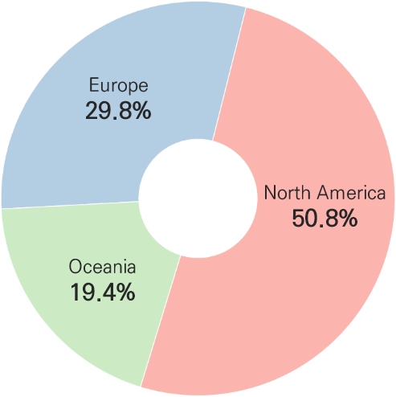

<details>
  <summary>국가별 대륙 매핑 딕셔너리 생성 code</summary>

  ```
  # 국가별 대륙 매핑 딕셔너리 생성
  country_to_continent = {
      'United States': 'North America',
      'Canada': 'North America',
      'Australia': 'Oceania',
      'United Kingdom': 'Europe',
      'France': 'Europe',
      'Germany': 'Europe'
  }

  # 대륙 컬럼 추가
  cu_df['Continent'] = cu_df['CustomerCountry'].map(country_to_continent)

  # 결과 확인
  cu_df
  ```
</details>
<details>
  <summary>대륙 데이터 프레임 생성 code</summary>

  ```
  cu_con_df = pd.DataFrame(cu_df['Continent'].value_counts()).reset_index()
  cu_con_df
  ```
</details>
<details>
  <summary>그래프 code</summary>

  ```
  import matplotlib.pyplot as plt
  import numpy as np

  # 파이 차트 그리기
  # 파이 차트 크기 설정
  plt.figure(figsize=(20, 10))

  # 부채꼴 스타일
  wedgeprops={'width': 0.7, 'edgecolor': 'w', 'linewidth': 1}

  labels = cu_con_df['Continent']
  sizes = cu_con_df['count']

  plt.rcParams['font.size'] = 20

  # 파이 차트 그리기, autopct: 각 항목의 비율을 소수점 첫째자리까지 표시, 첫 번째 항목이 시작되는 각도, 부채꼴 스타일
  patches, texts, autotexts = plt.pie(sizes, colors=colors, autopct='%1.1f%%', startangle=253, wedgeprops=wedgeprops) 

  # 원형으로 설정
  plt.axis('equal')
  #파이 차트 제목 설정
  plt.title('고객 거주 지역')
  plt.legend(cu_con_df['Continent'])

  plt.show()
  ```
</details>

<br></br>

### ○ 분석
✔ 북아메리카 고객이 약 50.8%로 가장 많은 것으로 집계

✔ 북아메리카를 거점으로 성장하며, 유럽, 오세아니아 대륙으로도 수출되는 것으로 나타남

<br></br>
<br></br>

## 2. 판매량 탐색
<details>
  <summary>판매 품목 데이터 전처리 code</summary>

  ```
  # 형변환 하기
  sa_to_df['ProductKey'] = sa_to_df['ProductKey'].astype(str)

  # 등급 별 총 구입 품목 확인
  sa_new_df['ProductKey'] = sa_to_df.groupby('CustomerKey')['ProductKey'].apply(lambda x: ', '.join(x)).reset_index()['ProductKey']
  sa_new_df

  # Product_Code를 ','를 기준으로 분할하여 리스트로 변환하는 함수
  def count_product(group):
      codes = group['ProductKey'].str.split(', ')
      # 각 그룹별로 Product_Code의 개수를 세기
      return pd.Series([len(codes) for codes in codes])

  # Level로 그룹화하고 각 그룹에 대해 Product_Code의 개수를 세는 함수를 적용
  level_product_counts = sa_new_df.groupby('Level').apply(count_product).reset_index()
  level_product_counts.columns = ['Level', 'ProductKey', 'ProductKeyCount']

  display(level_product_counts)
  ```
</details>
<details>
  <summary>데이터 프레임 생성 code</summary>

  ```
  # 전체 상품
  all_df = level_product_counts.groupby('ProductKey')['ProductKeyCount'].sum().reset_index()

  # 상위/하위 5개 상품
  top_all_df = all_df.nlargest(5, 'ProductKeyCount')
  bottom_all_df = all_df.nsmallest(5, 'ProductKeyCount')

  # 브론즈 상품
  bronze_df = level_product_counts[level_product_counts['Level'] == 'Bronze']

  # 등급별로 상위/하위 5개의 상품 선택(nlargest: 가장 큰 값 가져와줌)(nsmallest: 가장 작은 값 가져와줌)
  top_bronze_df = bronze_df.groupby('Level').apply(lambda x: x.nlargest(5, 'ProductKeyCount'))
  bottom_bronze_df = bronze_df.groupby('Level').apply(lambda x: x.nsmallest(5, 'ProductKeyCount'))

  # 실버 상품
  silver_df = level_product_counts[level_product_counts['Level'] == 'Silver']

  # 등급별로 상위/하위 5개의 상품 선택(nlargest: 가장 큰 값 가져와줌)(nsmallest: 가장 작은 값 가져와줌)
  top_silver_df = silver_df.groupby('Level').apply(lambda x: x.nlargest(5, 'ProductKeyCount'))
  bottom_silver_df = silver_df.groupby('Level').apply(lambda x: x.nsmallest(5, 'ProductKeyCount'))

  # 골드 상품
  gold_df = level_product_counts[level_product_counts['Level'] == 'Gold']

  # 등급별로 상위/하위 5개의 상품 선택(nlargest: 가장 큰 값 가져와줌)(nsmallest: 가장 작은 값 가져와줌)
  top_gold_df = gold_df.groupby('Level').apply(lambda x: x.nlargest(5, 'ProductKeyCount'))
  bottom_gold_df = gold_df.groupby('Level').apply(lambda x: x.nsmallest(5, 'ProductKeyCount'))

  # 다이아몬드 상품
  diamond_df = level_product_counts[level_product_counts['Level'] == 'Diamond']

  # 등급별로 상위/하위 5개의 상품 선택(nlargest: 가장 큰 값 가져와줌)(nsmallest: 가장 작은 값 가져와줌)
  top_diamond_df = diamond_df.groupby('Level').apply(lambda x: x.nlargest(5, 'ProductKeyCount'))
  bottom_diamond_df = diamond_df.groupby('Level').apply(lambda x: x.nsmallest(5, 'ProductKeyCount'))

  # 브이아이피 상품
  vip_df = level_product_counts[level_product_counts['Level'] == 'VIP']

  # 등급별로 상위/하위 5개의 상품 선택(nlargest: 가장 큰 값 가져와줌)(nsmallest: 가장 작은 값 가져와줌)
  top_vip_df = vip_df.groupby('Level').apply(lambda x: x.nlargest(5, 'ProductKeyCount'))
  bottom_vip_df = vip_df.groupby('Level').apply(lambda x: x.nsmallest(5, 'ProductKeyCount'))
  ```
</details>
<details>
  <summary>그래프 code</summary>

  ```
  fig, axes = plt.subplots(1, 2, figsize=(15, 6))

  plt.rcParams['font.size'] = 12

  sns.barplot(x='ProductKey', y='ProductKeyCount', data=top_all_df, palette=colors, ax=axes[0])
  axes[0].set_title('전체 상위 5개 상품')
  axes[0].set_ylabel('Count')
  axes[0].set_ylim(0, 90)
  sns.barplot(x='ProductKey', y='ProductKeyCount', data=bottom_all_df, palette=colors, ax=axes[1])
  axes[1].set_title('전체 하위 5개 상품')
  axes[1].set_ylabel('Count')
  axes[1].set_ylim(0, 90)

  # 상위 5개 제품
  display(top_all_df)
  # 하위 5개 제품
  display(bottom_all_df)

  plt.tight_layout()
  plt.show()
  ```
</details>

<br></br>

### ○ 전체 상위 5개 제품

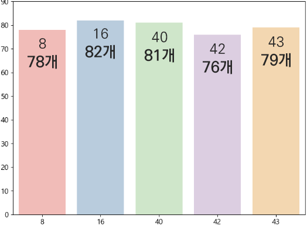

<br></br>

### ○ 전체 하위 5개 제품

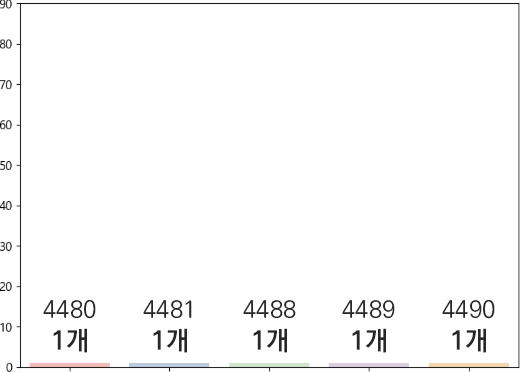

<br></br>

### ○ 분석
✔ 전체 상품 중 가장 인기 있는 상품은 16번으로 82개가 판매

✔ 전체 하위 5개 제품은 각 1개로 판매 개수가 동일하게 나타남

<br></br>
<br></br>

## 3. 고객 별 등급 분포

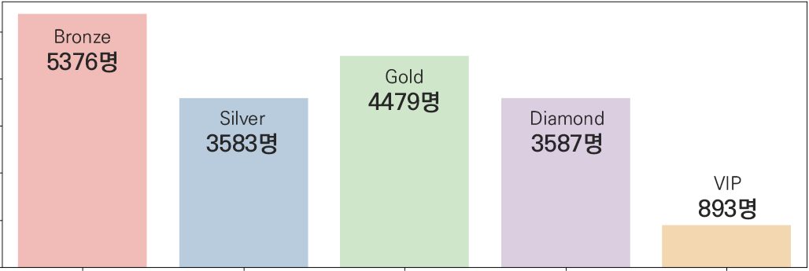

<details>
  <summary>code</summary>

  ```
  # 등급 별 고객수 도식화 하기
  level_columns = ['Bronze', 'Silver', 'Gold', 'Diamond', 'VIP']

  # 파이 차트 그리기
  # 파이 차트 크기 설정
  plt.figure(figsize=(15, 5))

  # 카테고리(측정불가 데이터)이기 때문에 countplot 사용
  sns.countplot(x='Level', data=sa_new_df, palette=colors, order=level_columns)

  plt.show()
  ```
</details>

<br></br>

### ○ 분석
✔ 총 17918명 고객 보유

✔ Bronze 고객이 가장 많이 나타나 신규 고객 유입이 잘 이루어지고 있다고 보이며, 고객을 유지할 수 있는 마케팅 전략이 필요함

✔ VIP 고객이 가장 적게 나타나 VIP 고객 유지 및 유입을 위한 마케팅 전략이 필요함

<br></br>
<br></br>

## 4. 등급 별 소비액

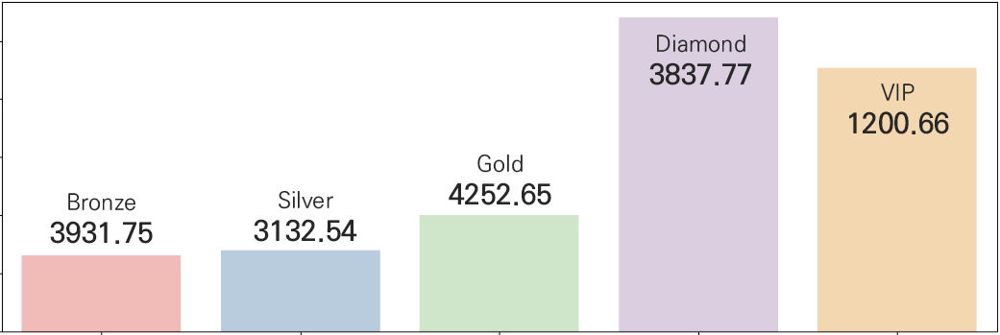

<details>
  <summary>등급별 소비액 확인 code</summary>

  ```
  # 등급 별 총 소비액 확인
  level_price_df = sa_new_df.groupby('Level').sum('TotalPirce').reset_index()
  level_price_df
  ```
</details>
<details>
  <summary>총 매출액 code</summary>

  ```
  # 총 매출액 확인
  level_price_df['TotalPirce'].sum()
  ```
</details>

<details>
  <summary>그래프 code</summary>

  ```
  # 등급 별 총 소비액 도식화
  level_columns = ['Bronze', 'Silver', 'Gold', 'Diamond', 'VIP']

  # 파이 차트 그리기
  # 파이 차트 크기 설정
  plt.figure(figsize=(15, 5))

  # 수량 데이터(측정 가능) 데이터이기 때문에 barplot를 사용
  sns.barplot(x='Level', y='TotalPirce', data=level_price_df, palette=colors, order=level_columns)

  plt.show()
  ```
</details>


<br></br>

### ○ 분석
✔ 총 매출액 29,307,837달러

✔ VIP 고객이 가장 적음에도 두번째로 높은 매출액을 달성하여 VIP 고객의 이탈 시 총 매출액의 영향이 클 것으로 판단되어 VIP 고객 유지를 위한 마케팅 전략이 필요함

✔ Bronze 고객이 가장 많음에도 가장 낮은 매출액을 달성하여 Bronze 고객을 대상으로한 마케팅 전략이 제대로 추진되지 않았고 구매를 높이기 위한 마케팅 전략이 필요함

<br></br>
<br></br>

## 5. 등급 별 인기/비인기 상품

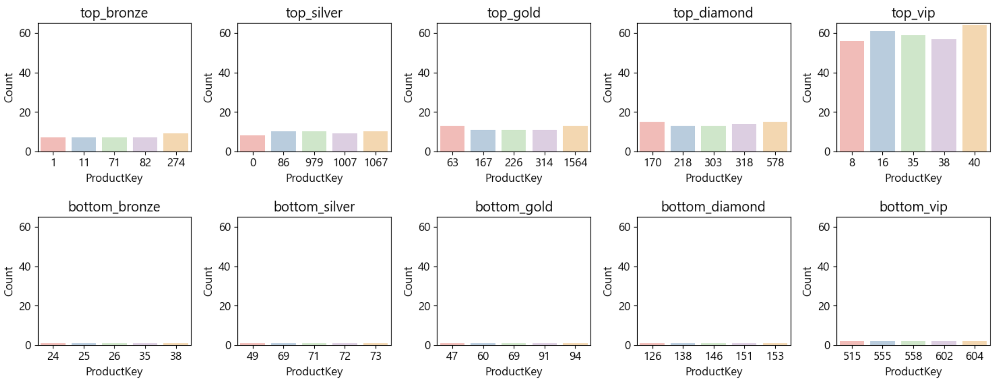

<details>
  <summary>code</summary>

  ```
display(pd.concat([top_bronze_df.reset_index(drop=True), bottom_bronze_df.reset_index(drop=True)], axis=1))
display(pd.concat([top_silver_df.reset_index(drop=True), bottom_silver_df.reset_index(drop=True)], axis=1))
display(pd.concat([top_gold_df.reset_index(drop=True), bottom_gold_df.reset_index(drop=True)], axis=1))
display(pd.concat([top_diamond_df.reset_index(drop=True), bottom_diamond_df.reset_index(drop=True)], axis=1))
display(pd.concat([top_vip_df.reset_index(drop=True), bottom_vip_df.reset_index(drop=True)], axis=1))

# 등급 별 상위 5개 상품 도식화
fig, axes = plt.subplots(1, 5, figsize=(15, 3))

sns.barplot(ax=axes[0], x='ProductKey', y='ProductKeyCount', data=top_bronze_df, palette=colors)
axes[0].set_title('top_bronze')
axes[0].set_ylabel('Count')
axes[0].set_ylim(0, 65)
sns.barplot(ax=axes[1], x='ProductKey', y='ProductKeyCount', data=top_silver_df, palette=colors)
axes[1].set_title('top_silver')
axes[1].set_ylabel('Count')
axes[1].set_ylim(0, 65)
sns.barplot(ax=axes[2], x='ProductKey', y='ProductKeyCount', data=top_gold_df, palette=colors)
axes[2].set_title('top_gold')
axes[2].set_ylabel('Count')
axes[2].set_ylim(0, 65)
sns.barplot(ax=axes[3], x='ProductKey', y='ProductKeyCount', data=top_diamond_df, palette=colors)
axes[3].set_title('top_diamond')
axes[3].set_ylabel('Count')
axes[3].set_ylim(0, 65)
sns.barplot(ax=axes[4], x='ProductKey', y='ProductKeyCount', data=top_vip_df, palette=colors)
axes[4].set_title('top_vip')
axes[4].set_ylabel('Count')
axes[4].set_ylim(0, 65)

plt.tight_layout()
plt.show()

# 등급 별 상위 5개 상품 도식화
fig, axes = plt.subplots(1, 5, figsize=(15, 3))

sns.barplot(ax=axes[0], x='ProductKey', y='ProductKeyCount', data=bottom_bronze_df, palette=colors)
axes[0].set_title('bottom_bronze')
axes[0].set_ylabel('Count')
axes[0].set_ylim(0, 65)
sns.barplot(ax=axes[1], x='ProductKey', y='ProductKeyCount', data=bottom_silver_df, palette=colors)
axes[1].set_title('bottom_silver')
axes[1].set_ylabel('Count')
axes[1].set_ylim(0, 65)
sns.barplot(ax=axes[2], x='ProductKey', y='ProductKeyCount', data=bottom_gold_df, palette=colors)
axes[2].set_title('bottom_gold')
axes[2].set_ylabel('Count')
axes[2].set_ylim(0, 65)
sns.barplot(ax=axes[3], x='ProductKey', y='ProductKeyCount', data=bottom_diamond_df, palette=colors)
axes[3].set_title('bottom_diamond')
axes[3].set_ylabel('Count')
axes[3].set_ylim(0, 65)
sns.barplot(ax=axes[4], x='ProductKey', y='ProductKeyCount', data=bottom_vip_df, palette=colors)
axes[4].set_title('bottom_vip')
axes[4].set_ylabel('Count')
axes[4].set_ylim(0, 65)

plt.tight_layout()
plt.show()
  ```
</details>

<br></br>

### ○ 분석
✔ 전체 상품의 상위 2개 상품의 약 75~78%는 VIP 등급이 차지

✔ 인기 상품은 VIP 비중이 가장 크며, 등급 별 인기 있는 상품의 품목이 모두 다름에 따라 각 등급별 구매율이 높은 제품에 대한 마케팅 전략이 필요함

<br></br>
<br></br>

## 6. 등급 별 활동성

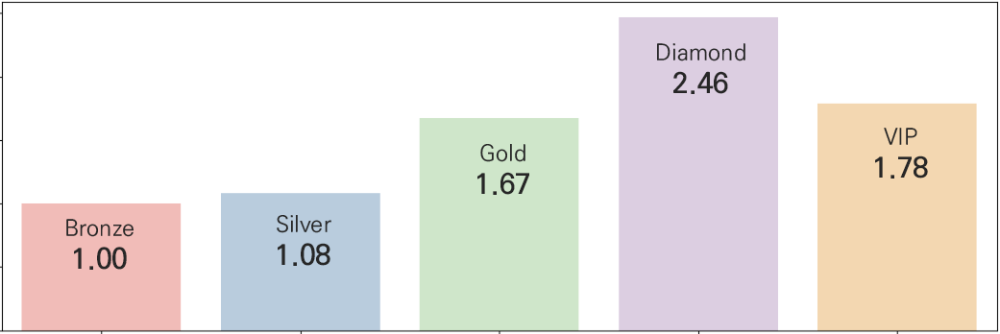

<details>
  <summary>각 등급 별 회원의 Recently 평균을 구하기 code</summary>

  ```
  # 각 등급 별 회원의 Recently 평균을 구하고 소수점 2자리까지 표기
  recently_date_df = round(sa_new_df.groupby('Level')['RecentlyDate'].mean().reset_index(), 2)
  recently_date_df
  ```
</details>
<details>
  <summary>정규화 code</summary>

  ```
  # 동일한 범위에서 정확한 분석을 위해 등급별 매출액, 인원수, 활동성으로 정규화 진행

  # 등급 별 인원수를 구해 새로운 데이터 프레임에 담기
  level_counts = sa_new_df['Level'].value_counts().reset_index()

  # 활동성 평균 데이터 추가
  level_recently = sa_new_df.groupby('Level')['RecentlyDate'].mean().reset_index()

  # 총 매출액 데이터 추가
  level_pirce = level_price_df.copy()
  level_pirce = level_pirce.drop(labels=['CustomerKey', 'RecentlyDate', 'OrderCount', 'TotalScore'], axis=1)

  # 데이터 프레임 합치기
  merged_df = pd.merge(level_counts, level_recently, on='Level')
  merged_df = pd.merge(merged_df, level_pirce, on='Level')
  merged_df

  # level 피처 삭제
  rfm = merged_df.drop(labels=['Level'], axis=1)
  display(rfm)

  # 정규화 진행
  normalization = MinMaxScaler()
  rfm_normalization = normalization.fit_transform(rfm)
  ```
</details>
<details>
  <summary>활동성 code</summary>

  ```
  # 정규화된 데이터 데이터 프레임으로 변환
  rfm = pd.DataFrame(rfm_normalization, columns=rfm.columns)

  # 레벨 피처 추가
  rfm['Level'] = merged_df['Level']

  # recently_mean_date는 현재 낮을 수록 최신에 가깝고, 최신 점수가 더 높아야 하기 때문에 1을 빼서 점수를 높여준다.
  rfm['RecentlyDate'] = 1 - rfm['RecentlyDate']

  # 등급 값 추가
  rfm['PriceTotalScore'] = rfm[['count', 'TotalPirce', 'RecentlyDate']].sum(axis=1)
  # # 등급 값만 필요하므로 사용이 완료된 피처 삭제
  rfm = rfm.drop(labels=['count', 'TotalPirce', 'RecentlyDate'], axis=1)
  rfm
  ```
</details>
<details>
  <summary>그래프 code</summary>

  ```
  level_columns = ['Bronze', 'Silver', 'Gold', 'Diamond', 'VIP']

  # 파이 차트 그리기
  # 파이 차트 크기 설정
  plt.figure(figsize=(15, 5))

  # 수량 데이터(측정 가능) 데이터이기 때문에 barplot를 사용
  sns.barplot(x='Level', y='PriceTotalScore', data=rfm, palette=colors, order=level_columns)

  plt.show()
  ```
</details>

<br></br>

### ○ 분석
✔ Bronze 고객이 가장 많음에도 활동성이 가장 낮게 나와 라이트 구매자가 많다고 판단되며, Bronze 고객의 구매를 촉진하기 위해 마케팅 전략이 필요함

✔ 매출액의 높은 부분을 차지하고 있는 Diamond, VIP 고객의 활동성이 높아 해당 고객의 마케팅이 잘 추진되는 것으로 보여지나 이탈 시 총 매출액에 큰 손실이있을 것이라 판단됨

<br></br>
<br></br>

## 7. 분기 별 순이익

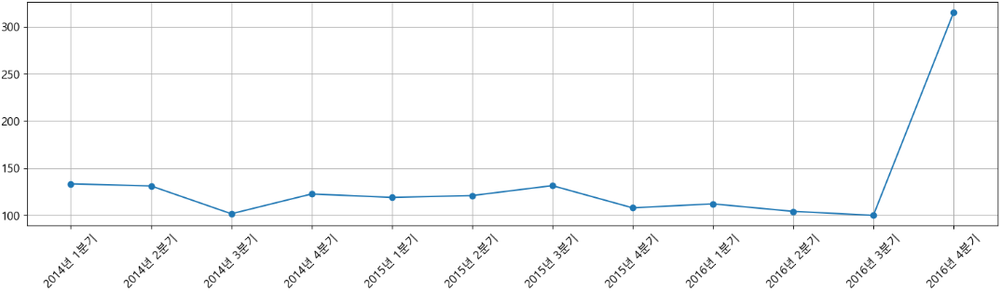

<details>
  <summary>날짜 별 순이익 code</summary>

  ```
  # 날짜 별 순이익 확인
  merged_date_four_df = round(merged_date_df.groupby('Date')['NetProfit'].mean(), 2).reset_index()
  merged_date_four_df
  ```
</details>
<details>
  <summary>분기 변환 code</summary>

  ```
  # 날짜를 연도와 분기로 변환하는 함수 정의
  def get_year_quarter(date):
      year = date.year
      month = date.month
      quarter = (month - 1) // 3 + 1
      return f"{year}년 {quarter}분기"
  ```
</details>
<details>
  <summary>분기 별 순이익 계산 code</summary>

  ```
  # Date 컬럼을 datetime 형식으로 변환
  merged_date_four_df['Date'] = pd.to_datetime(merged_date_four_df['Date'])

  # 분기 컬럼 추가
  merged_date_four_df['YearQuarter'] = merged_date_four_df['Date'].apply(get_year_quarter)

  merged_date_four_df = merged_date_four_df.drop(labels='Date', axis=1)

  merged_date_four_df = round(merged_date_four_df.groupby('YearQuarter')['NetProfit'].mean().reset_index(), 2)
  merged_date_four_df
  ```
</details>
<details>
  <summary>그래프 code</summary>

  ```
  # 시계열 그래프 그리기
  plt.figure(figsize=(15, 5))
  plt.plot(merged_date_four_df['YearQuarter'], merged_date_four_df['NetProfit'], marker='o', linestyle='-')
  plt.title('분기 별 순이익 현황')
  plt.xlabel('분기')
  plt.ylabel('순이익')
  plt.xticks(rotation=45)
  plt.grid(True)
  plt.tight_layout()
  plt.show()
  ```
</details>

<br></br>

### ○ 분석
✔ 2016년 4분기에 매출액이 이전보다 3배 정도 상승

✔ 이 기간에 진행된 마케팅 방식이 제대로 추진되었다고 판단되어 추후 진행될 마케팅에서 해당 마케팅 방식을 차용하여 진행

<br></br>
<br></br>
<br></br>
<br></br>
<br></br>

# Ⅴ. 결론
## 1. 요약
### ○ 등급 별 활동성


<br>

✔ Diamond 고객의 활동성이 가장 높고, Bronze 고객의 활동성 가장 낮음

✔ Bronze 고객이 가장 많음에도 활동성이 가장 낮게 나와 라이트 구매자가 많다고 판단되며, Bronze 고객의 구매를 촉진하기 위해 마케팅 전략이 필요함

✔ 매출액의 높은 부분을 차지하고 있는 Diamond, VIP 고객의 활동성이 높아 해당 고객의 마케팅이 잘 추진되는 것으로 보여지나 이탈 시 총 매출액에 큰 손실이있을 것이라 판단됨

<br></br>

### ○ 등급 별 인기 상품

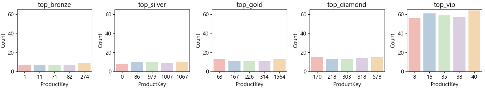

<br>

✔ 전체 상품의 상위 2개 상품의 약 75~78%는 VIP 등급이 차지

✔ 인기 상품은 VIP 비중이 가장 크며, 등급 별 인기 있는 상품의 품목이 모두 다름에 따라 각 등급별 구매율이 높은 제품에 대한 마케팅 전략이 필요함

<br></br>
<br></br>

## 2. 마케팅 전략 제안
✔ **각 등급에 따른 혜택 제공**  
R(recency)를 유지하고 F(Frequency)를 증대하기 위해 각 등급에 따른 할인 혹은 혜택을 제공하여, 고객의 만족도를 높이고 이탈을 방지

<br>

✔ **Diamond, VIP 고객 유지 전략**  
Diamond, VIP 고객 수요가 있는 상품을 개선/개발하여 더 다양한 선택지를 제공하여 F(Frequency) 및 M(Monetary)를 증대하고 프리미엄한 혜택 제공으로 R(recency)를 유지

<br>

✔ **이탈 고객 대상 마케팅 전략**  
R(recency)가 낮아 이탈 가능성이 높은 등급을 대상으로한 특별한 프로모션을 진행하며, SMS, 이메일 등으로 다양한 혜택을 제공하며 이탈을 방지한다.

<br>

✔ **상품별 마케팅 전략**  
수요가 높은 상품을 개선/개발하여 다양한 선택지를 제공하고 프로모션으로 구매 촉진하고유명 운동선수/인플루언서 홍보로 F(Frequency) 및 M(Monetary)를 증대

<br>

✔ **매출액이 낮은 등급의 구매 유도 전략**  
수요가 있는 상품을 개선/개발하여 F(Frequency) 및 M(Monetary)를 증대

<br>

✔ **대륙 별 트렌드에 맞는 마케팅 전략**  
다양한 국가의 고객을 유치하고 R(recency)를 높이기 위해 맞춤형 광고를 제작하여 홍보를 강화하는 등 신규 고객 유치를 위한 마케팅 방안을 마련

<br>

✔ **매출액이 높았던 분기의 마케팅 전략 차용**  
매출액이 높은 분기의 마케팅 전략을 차용 및 고도화하여 F(Frequency), M(Monetary)를 유지하고 증대할 수 있도록 한다.

<br></br>
<br></br>

## 3. 트러블 슈팅
### ○ RFM 데이터

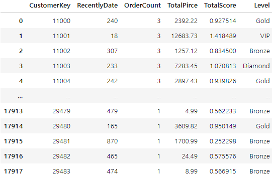

<br>

✔ 해당 RFM 분석은 가중치가 적용 안된 상태로 분석된 데이터

✔ 위 데이터 확인 시 Frequency의 영향이 가장 낮고, Monetary, Recency 순으로 등급이 결정되는 것을 확인함

✔ 현재 유지되는 고객이 가장 중요하다고 생각되어 Recency에 가장 높은 비중을 두고 Monetary, Frequency 순으로 가중치를 부여하여 추가 분석 진행이 가능함
