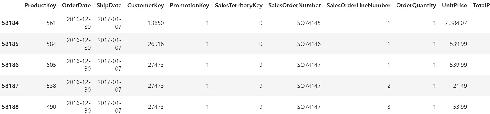

# Sport RFM Data Analysis Project
스포츠 용품 RFM 분석

<br>


<br>

2024.04.23.

<br></br>
<br></br>
<br></br>
<br></br>
<br></br>

# Ⅰ. 프로젝트 개요
## 1. 프로젝트 목표
스포츠 용품 판매점의 RFM을 분석하여 고객을 세분화하고 고객의 가치를 평가하여 효과적인 마케팅 전략을 발굴

<br></br>
<br></br>

## 2. 프로젝트 기획
✔ 고객 별 등급 분포 분석  
등급 별 소비액, 구입 품목, 활동성 분석

<br>

✔ 상품 판매량 분석
전체 상품 판매량 및 등급 별 판매량 분석

<br></br>
<br></br>

## 3. 프로젝트 기대효과
✔ 고객 충성도 강화 및 유지율 향상  
고객 세분화 맞춤형 마케팅을 실행하여 고객의 충성도 강화 및 유지율 향상

<br>

✔ 매출 증대  
구매 빈도를 분석하여 상품별 마케팅 전략 실행으로 매출 증대를 기대

<br></br>
<br></br>

## 4. 데이터 흐름
### ○ RFM 분석 프로세스

<br>


<br></br>
<br></br>

## 5. 데이터 수집
✔ 데이터 정보  
Kaggle의 Sporting goods store 데이터 세트 활용 (CSV 파일)
https://www.kaggle.com/datasets/cnezhmar/sporting-goods-store

<br>

✔ 총 데이터 개수: 58189개 데이터

<br>

✔ 고객 데이터 (21개 feature)  

| 연번 |  컬럼명                  | 컬럼 설명         |
|:----:|:-----------------------:|:---------------:|
| 1  | CustomerKey           | 고객 ID         |
| 2  | FirstName             | 고객의 성         |
| 3  | LastName              | 고객 이름         |
| 4  | FullName              | 고객의 전체 이름     |
| 5  | BirthDate             | 생년월일          |
| 6  | MaritalStatus         | 결혼 상태         |
| 7  | Gender                | 성별            |
| 8  | YearlyIncome          | 연 소득          |
| 9  | TotalChildren         | 총 자녀 수        |
| 10 | NumberChildrenAtHome  | 집에 있는 자녀 수    |
| 11 | Education             | 고객 교육         |
| 12 | Occupation            | 고객의 직업        |
| 13 | HouseOwnerFlag        | 부동산(집)의 가용성   |
| 14 | NumberCarsOwned       | 소유한 자동차 수     |
| 15 | AddressLine1          | 고객의 거주지 주소    |
| 16 | DateFirstPurchase     | 첫 구매 날짜       |
| 17 | CommuteDistance       | 이동 거리         |
| 18 | CustomerCity          | 고객의 도시        |
| 19 | CustomerStateCode     | 고객의 주(지역) 코드  |
| 20 | CustomerState         | 고객의 주(지역)     |
| 21 | CustomerCountry       | 고객 국가         |

<br>

✔ 판매 데이터 (13개 feature)  

| 연번 |  컬럼명                  | 컬럼 설명      |
|:---:|:---------------------:|:----------:|
| 1  | ProductKey            | 제품 ID      |
| 2  | OrderDate             | 주문 날짜      |
| 3  | ShipDate              | 배송 날짜      |
| 4  | CustomerKey           | 고객 ID      |
| 5  | PromotionKey          | 광고 키       |
| 6  | SalesTerritoryKey     | 판매자 ID     |
| 7  | SalesOrderNumber      | 등록 키       |
| 8  | SalesOrderLineNumber  | 주문 번호      |
| 9  | OrderQuantity         | 주문 수량      |
| 10 | UnitPrice             | 상품 1개당 가격  |
| 11 | TotalProductCost      | 총 생산 비용    |
| 12 | SalesAmount           | 판매액        |
| 13 | TaxAmt                | 세액         |

<br></br>
<br></br>
<br></br>
<br></br>
<br></br>

# Ⅱ. 데이터 탐색 및 전처리

## 1. 판매 데이터 탐색
### ○ head


<details>
  <summary>code</summary>

  ```
  # 상위 5개 데이터 확인
  sa_df.head()
  ```
</details>

<br></br>

### ○ tail


<details>
  <summary>code</summary>

  ```
  # 하위 5개 데이터 확인
  sa_df.tail()
  ```
</details>

<br></br>

### ○ info


<details>
  <summary>code</summary>

  ```
  # sa_df 정보 가져오기
  sa_df.info()
  ```
</details>

<br></br>

### ○ 결측치 데이터 확인


<details>
  <summary>code</summary>

  ```
  # 결측치 데이터 개수 확인
  sa_df.isna().sum()
  ```
</details>

<br></br>

### ○ 중복행 데이터 확인


<details>
  <summary>code</summary>

  ```
  # 중복행 데이터 개수 확인
  sa_up_df.duplicated().sum()
  ```
</details>

<br></br>

### ○ 분석
✔ 상/하위 다섯개 데이터를 확인한 결과 인덱스 외 고유의 ID 확인

✔ 고객 데이터의 CustomerKey 컬럼이 판매 데이터의 FK로 들어간 것을 확인함

✔ 결측치와 중복행은 없는 것으로 확인

✔ SalesAmount 컬럼에 ,(콤마)가 존재하는 것으로 확인되어 전처리가 필요함

<br></br>

### ○ 가설
✔ 환불된 주문 데이터가 있을까? (음수 확인 필요)

<br></br>
<br></br>

## 2. 판매 데이터 전처리
### ○ replace
✔ SalesAmount 컬럼 데이터 속 ,(콤마) 제거

<details>
  <summary>code</summary>

  ```
  # replace를 통해 ,(콤마) 제거
  sa_df['SalesAmount'] = sa_df['SalesAmount'].str.replace(',', '').astype(float)
  ```
</details>


<br></br>

### ○ 음수 데이터 확인
✔ 환불된 데이터(음수)가 있는지 확인


<details>
  <summary>code</summary>

  ```
  # 음수 데이터(환불) 존재 여부 확인
  sa_df[sa_df['SalesAmount'] <= 0]
  ```
</details>

<br></br>

### ○ 분석
✔ 환불된 데이터는 없는 것으로 확인

<br></br>

### ○ 컬럼 제거
✔ 프로젝트 분석 목표와 맞지 않는 컬럼 제거

✔ ShipDate(배송날짜), SalesOrderLineNumber(주문번호), UnitPrice(상품 1개당 가격)

<details>
  <summary>code</summary>

  ```
  # 불필요한 피처 삭제
  sa_up_df = sa_df.drop(labels=['ShipDate', 'SalesOrderLineNumber', 'UnitPrice'], axis=1)
  sa_up_df
  ```
</details>

<br></br>
<br></br>

## 3. 회원 데이터 탐색
### ○ head


<details>
  <summary>code</summary>

  ```
  # 상위 5개 데이터 확인
  cu_df.head()
  ```
</details>

<br></br>

### ○ tail


<details>
  <summary>code</summary>

  ```
  # 하위 5개 데이터 확인
  cu_df.tail()
  ```
</details>

<br></br>

### ○ info


<details>
  <summary>code</summary>

  ```
  # cu_df 정보 가져오기
  cu_df.info()
  ```
</details>

<br></br>

### ○ 결측치 데이터 확인


<details>
  <summary>code</summary>

  ```
  # 결측치 데이터 개수 확인
  cu_df.isna().sum()
  ```
</details>

<br></br>

### ○ 중복행 데이터 확인


<details>
  <summary>code</summary>

  ```
  # 중복행 데이터 개수 확인
  cu_df.duplicated().sum()
  ```
</details>

<br></br>

### ○ 국가 확인


<details>
  <summary>code</summary>

  ```
  cu_df['CustomerCountry'].value_counts()
  ```
</details>

<br></br>

### ○ 분석
✔ 상/하위 다섯개 데이터를 확인한 결과 인덱스 외 고유의 ID 확인

✔ 고객 데이터의 CustomerKey 컬럼이 판매 데이터의 FK로 들어간 것을 확인함

✔ 결측치와 중복행은 없는 것으로 확인

✔ SalesAmount 컬럼에 ,(콤마)가 존재하는 것으로 확인되어 전처리가 필요함

<br></br>

### ○ 가설
✔ 환불된 주문 데이터가 있을까? (음수 확인 필요)

<br></br>
<br></br>

## 2. 회원 데이터 전처리
### ○ replace
✔ SalesAmount 컬럼 데이터 속 ,(콤마) 제거

<details>
  <summary>code</summary>

  ```
  # replace를 통해 ,(콤마) 제거
  sa_df['SalesAmount'] = sa_df['SalesAmount'].str.replace(',', '').astype(float)
  ```
</details>


<br></br>

### ○ 음수 데이터 확인
✔ 환불된 데이터(음수)가 있는지 확인


<details>
  <summary>code</summary>

  ```
  # 음수 데이터(환불) 존재 여부 확인
  sa_df[sa_df['SalesAmount'] <= 0]
  ```
</details>

<br></br>

### ○ 분석
✔ 환불된 데이터는 없는 것으로 확인

<br></br>

### ○ 컬럼 제거
✔ 프로젝트 분석 목표와 맞지 않는 컬럼 제거

✔ ShipDate(배송날짜), SalesOrderLineNumber(주문번호), UnitPrice(상품 1개당 가격)

<details>
  <summary>code</summary>

  ```
  # 불필요한 피처 삭제
  sa_up_df = sa_df.drop(labels=['ShipDate', 'SalesOrderLineNumber', 'UnitPrice'], axis=1)
  sa_up_df
  ```
</details>

<br></br>
<br></br>
<br></br>
<br></br>
<br></br>

# Ⅲ 